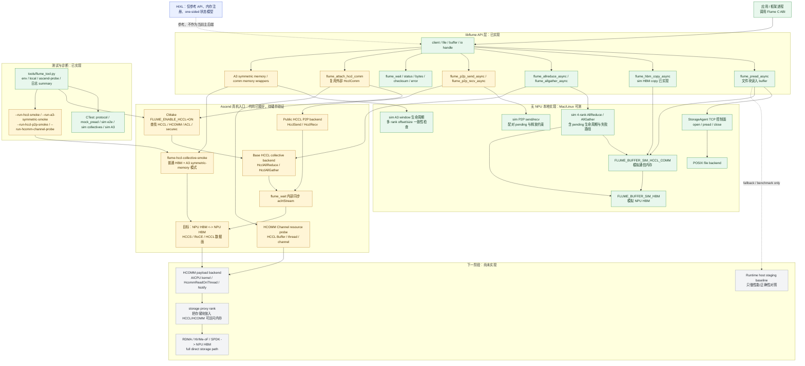
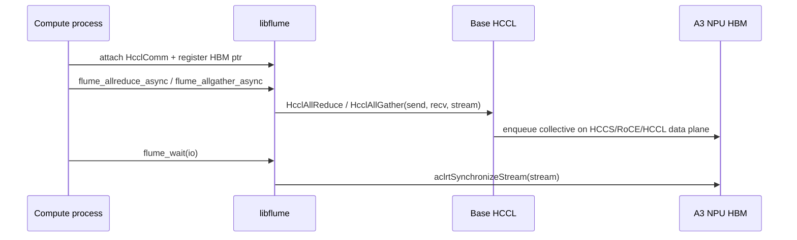
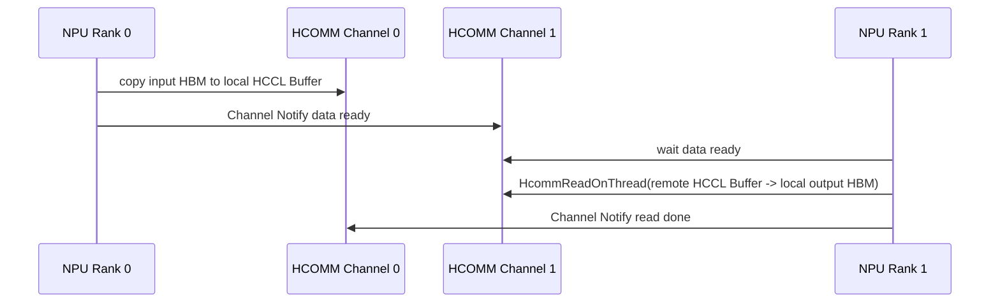
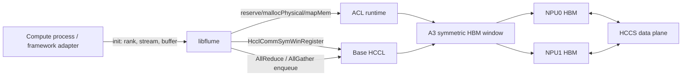
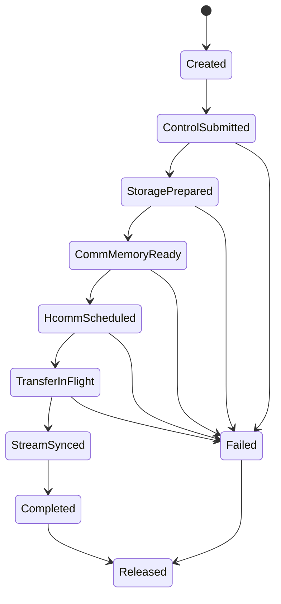
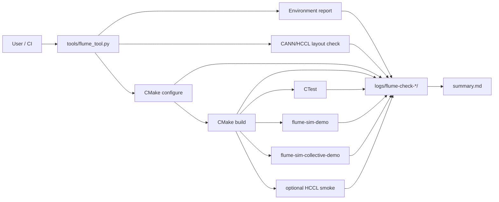

# Flume: Host-Bypass Data Path for Ascend NPU 架构设计

日期：2026-08-03

## 1. 背景与定位

Flume 的目标不是单纯做一个“远端文件读取库”，也不是重做 HCCL collective。HCCL 本身已经支持 NPU HBM 之间的 host-memory-bypass 通信：正常 AllReduce、AllGather、Send/Recv 的 payload 可以走 HCCS/RoCE/PCIe 数据面，不需要先搬到 host DRAM。

Flume 要补的是 HCCL 没有覆盖的部分：**把存储数据接入 NPU HBM 数据路径，并在 CANN/HCCL/HCOMM 能力差异下给上层一个稳定、可诊断、可降级的 runtime**。

本项目基于 Ascend CANN 开源 HCCL/HCOMM 通信体系，探索两类数据路径：

- 远端存储到 NPU HBM：远端存储数据通过 RDMA/存储侧 DMA/HCCL-HCOMM 通信链路进入目标 NPU HBM。
- NPU HBM 到 NPU HBM：不同 NPU rank 的 HBM 之间通过 HCCL/HCOMM 互通；这部分 HCCL 已经提供主能力，Flume 只把它作为 baseline、fallback 和 HCOMM 下钻前的验证路径。

因此本项目主线应是 **HCCL/HCOMM-first**。HIXL 不作为第一优先实现基座，而作为 one-sided transfer、内存注册、异步请求状态和能力协商的参考样板。

当前代码命名已与项目名对齐：对外 C ABI 使用 `flume_*` 前缀，CMake target 使用 `flume` / `libflume`。

公开 HCOMM 通信模型中已经有几个与本项目高度匹配的概念：

- 通信内存：通信成员上的一块内存可以注册给通信域，使通信域内其他通信成员访问。
- Endpoint：通信对象的网络逻辑端口，包含协议、地址等属性。
- Channel：本端 Endpoint 与远端 Endpoint 之间的通信通道。RoCE 场景下 Channel 关联 QP，并带有 Notify。
- 网络语义：开发者基于 Channel 读写远端通信内存或做远端同步。
- 内存语义：部分场景下远端通信内存可映射到本地地址空间。

HCCL 自定义 P2P 示例也已经展示了核心路径：

```text
HcclGetHcclBuffer
HcclChannelGetHcclBuffer
HcommLocalCopyOnThread
HcommChannelNotifyRecordOnThread
HcommChannelNotifyWaitOnThread
HcommReadOnThread
```

这比 HIXL 更贴近本项目真正要改造和扩展的底层。

### 1.1 Flume 与 HCCL 的职责边界

| 问题 | HCCL 已覆盖 | Flume 应覆盖 |
| --- | --- | --- |
| NPU tensor AllReduce / AllGather | 已覆盖，且 payload 通常不经过 host memory staging | 不重复实现，只包装、探测、对齐错误语义和作为 fallback |
| NPU HBM 点对点拷贝 | `HcclSend` / `HcclRecv` 可覆盖公开 P2P baseline | 暴露成 Flume P2P API，作为 HCOMM payload backend 的对照 |
| HCCS/RoCE/PCIe fabric 选择 | HCCL 根据拓扑和初始化路径选择 | 记录、诊断、避免把 rank-table/VNIC 失败误判成 Flume 数据面失败 |
| HCOMM Channel / HCCL Buffer | HCOMM 提供底层资源接口 | 封装 resource probe，后续实现 HCOMM primitive payload copy |
| 远端存储块如何进入 HBM | 不是 HCCL 职责 | Flume 核心目标：storage proxy、HCCL/HCOMM visible buffer、未来 RDMA/storage direct path |
| CANN 8.5 与高版本差异 | 由安装环境暴露 header/symbol | Flume feature probe + fallback，缺能力返回 unsupported |

因此本文档中的 “host-bypass” 不是指 host 完全退出系统，而是指 **payload 不经 host memory staging**。host 仍负责初始化、建链、任务下发、错误诊断和 fallback 决策。最终目标是在 storage->HBM payload 上也达到类似 HCCL tensor 通信的数据路径属性。

## 2. 目标与非目标

### 2.1 目标

- 以 HCCL/HCOMM 为主数据平面，探索 storage -> NPU HBM 和 HBM -> HBM 的无 host CPU 数据搬运。
- 复用 HCCL 通信域、rank、Channel、Notify、HCCL Buffer、通信内存注册和任务编排模型。
- 设计一个存储桥接层，把远端文件 offset/length 读请求映射到 HCCL/HCOMM 可搬运的数据块。
- 在上层提供稳定 C ABI，使框架或应用尽量只看到“远端文件块读入 NPU buffer”。
- 在无 NPU 环境下保留 mock 控制面、协议测试和 sim 端到端路径，保证代码可写、可测、可演进。
- 在 Ascend 真机环境下优先验证 HCCL/HCOMM HBM-HBM 路径，再验证 storage->HBM 路径。
- 将 HIXL 作为参考：学习它的 `RegisterMem`、`TransferSync/Async`、READ/WRITE、请求状态查询和 capability 设计。

### 2.2 非目标

- 第一阶段不把 HIXL 作为主实现后端。
- 第一阶段不把 Runtime staging 视为目标路径；它只作为 correctness/performance baseline。
- 第一阶段不承诺纯存储服务器无需任何厂商接口即可直接成为 HCCL rank。
- 第一阶段不修改 Linux VFS、block layer 或 NVMe-oF host。
- 第一阶段不承诺完全 POSIX 透明拦截。

## 3. 关键判断

### 3.0 当前可测试性

当前代码已经可以测试 Stage 0、Stage 1，以及 Stage 2 的 base HCCL collective 初版入口：

| 范围 | 当前状态 | 如何测试 | 说明 |
| --- | --- | --- | --- |
| 协议 framing | 已实现 | `ctest -R protocol` | 验证 frame 编解码和 body 解析 |
| mock storage pread | 已实现 | `ctest -R mock_pread` | 验证本地 agent、TCP 控制面、offset/length/checksum |
| local sim e2e | 已实现 | `ctest -R sim_end_to_end` 或 `flume-sim-demo` | 验证 storage->SIM_HCCL_COMM->SIM_HBM 的 API 形状 |
| local sim collectives | 已实现 | `ctest -R sim_collectives` 或 `flume-sim-collective-demo` | 验证 4-rank AllReduce/AllGather API、等待和结果布局 |
| local sim P2P copy | 已实现 | `ctest -R sim_p2p_copy` | 验证 `flume_p2p_send_async` / `flume_p2p_recv_async` 的配对、pending、释放约束和数据正确性 |
| CANN/HCCL 发现 | 可探测 | `tools/flume_tool.py ascend-probe` | 验证 `ASCEND_HOME_PATH`、HCCL 头文件和库、CMake link |
| Base HCCL collectives | 初版已实现，root-info 为首选真机打通路径 | `tools/flume_tool.py --build-dir build-ascend --run-hccl-smoke --hccl-devices 0,1 ascend-probe` | Flume 包装 `HcclAllReduce` / `HcclAllGather`，输入输出为 Ascend HBM；rank-table 保留为 VNIC/P2P 诊断路径，单机 HCCS_SW 暂未通过真机验证 |
| HCCL P2P HBM copy | 初版已实现，待更多卡对验证 | `tools/flume_tool.py --build-dir build-p2p --run-hccl-p2p-smoke --hccl-devices 0,1 ascend-probe` | Flume 包装公开 `HcclSend` / `HcclRecv`，当前 smoke 测 rank0 HBM -> rank1 HBM；这是 HCOMM payload backend 前的公开 HCCL baseline |
| A3 symmetric memory collectives | 初版已实现，按 CANN/HCCL 能力位启用 | `tools/flume_tool.py --build-dir build-a3 --run-a3-symmetric-smoke --hccl-devices 0,1 ascend-probe` | 需要 ACL VMM、`HcclCommInitRootInfoConfig`、symmetric-window config 字段和 `HcclCommSymWinRegister` 均存在 |
| HCOMM Channel resource probe | CANN 8.5 真机已验证 resource path | `tools/flume_tool.py --build-dir build-hcomm --run-hcomm-channel-probe --hccl-devices 0,1 ascend-probe` | Flume 会探测 `HcclGetHcclBuffer`、CPU_TS/AICPU_TS thread resource、rank graph / legacy descriptor、可选 thread export、可配置 engine/protocol 的 `HcclChannelAcquire` 和 `HcclChannelGetHcclBuffer`；CANN 8.5 默认 `engine=auto -> cpu-ts`，严格 thread-export 返回 unsupported；默认成功只代表 channel resource path，尚未 launch AICPU kernel 或执行 `HcommReadOnThread` payload copy |
| HCOMM payload copy sim | 本地已实现 rank-pair sim backend | `ctest --test-dir build-local-next -R sim_hcomm_payload` | `flume_hcomm_payload_send_async` / `flume_hcomm_payload_recv_async` 验证 send-first / recv-first、peer 校验、pending IO 和 buffer 生命周期；真实 HCOMM primitive scheduler 仍返回 unsupported |
| storage partial-direct sim | 本地已实现最小骨架 | `ctest --test-dir build-local-next -R sim_hcomm_payload_failures` | `flume_prepare_storage_block_async` / `flume_read_to_hbm_async` 当前模拟 `file offset -> SIM_HCCL_COMM -> SIM_HBM`；真实 storage->Ascend HBM direct path 仍返回 unsupported |
| Ascend full matrix | Host B (CANN 9.0) 真机已通过；CANN 8.5 构建和 feature probe 已通过，smoke 受 Host A 资源占用影响未完成 | `tools/flume_tool.py --build-dir build-full --hccl-devices <device-a>,<device-b> --hccl-host-ifname <host-ifname> --hccl-host-ip <host-ip> --hccl-debug-logs ascend-full-matrix` | Host B HCCS_SW 卡对通过 required 步，包括 Stage 3A storage-HBM fallback；strict payload-copy 是 optional expected negative；Host A 当前因 NPU 任务占满导致 VNIC socket listen 失败，不归类为代码问题 |
| storage/RDMA->NPU HBM | 待探索 | 暂不可真实测试 | 依赖外部 RDMA/NVMe-oF 与 NPU HBM/comm memory 的注册和同步能力 |

因此，现在可以把仓库拿到 Ascend 主机上做“环境、编译、链接、mock/sim 回归”、base HCCL AllReduce/AllGather HBM collective smoke、公开 HCCL `Send/Recv` 的 P2P HBM copy smoke、CANN 8.5/9.0 HCOMM Channel resource probe、payload readiness strict negative，以及 Stage 3A storage-HBM fallback smoke。Host B (CANN 9.0) full-matrix 已证明这些路径在空闲 HCCS_SW 卡对上可通过，并已用本地 SSD 输入文件完成 16 MiB `storage_hbm=hccl-p2p-staging` 验证；Host A (CANN 8.5) 当前 smoke 失败来自卡被长任务占用后的 VNIC socket 资源冲突。如果 CMake 探测到 A3 相关试用接口存在，还可以在 Atlas A3 HCCS 场景下跑 symmetric-memory collective smoke。当前只能本地模拟 HCOMM payload copy，并在真机上验证 storage-HBM 的 HCCL P2P staging fallback；还不能宣称真实 HCOMM primitive/custom-op payload copy 或真实 storage->Ascend HBM direct path 已打通。

### 3.1 HCCL/HCOMM 是主线

HCCL/HCOMM 已经拥有 NPU rank、通信域、HCCS/RoCE/PCIe、通信内存、Channel 和 Notify 等能力。我们的核心问题可以拆成：

```text
storage data block
  -> HCCL/HCOMM 可识别或可访问的通信内存
  -> HCOMM Channel 搬运
  -> target NPU HBM
```

HBM-HBM 通信可以先使用已有 HCCL P2P 和 HCOMM 自定义通信算子开发接口验证。

storage->HBM 则需要解决“存储端如何把数据放入 HCCL/HCOMM 通信内存，或如何让存储/RDMA endpoint 参与 HCOMM Channel”的问题。

### 3.2 HIXL 是参考，不是主轴

HIXL 的价值在于它的接口形态很接近我们希望给上层提供的语义：

```text
RegisterMem
Connect
TransferSync READ/WRITE
TransferAsync
GetTransferStatus
```

但 HIXL 不是存储系统，也不是 HCCL/HCOMM 内部通信模型本身。我们可以参考它的 API 和状态模型，但主实现应尽量落在 HCCL/HCOMM 上。

### 3.3 Runtime staging 是基线，不是目标

`agent pread -> host pinned buffer -> aclrtMemcpyAsync -> NPU HBM` 可以用于无 HCCL 路径时做正确性和性能基线，但它经过 host memory 和 host 侧数据搬运，不符合项目最终目标。

## 4. 总体架构



图例：

| 状态 | 含义 |
| --- | --- |
| 绿色 | 当前仓库已经实现，并已在无 NPU 本地测试中验证 |
| 黄色 | 代码入口和编译路径已经实现，需要 Ascend/A3 真机继续验证 |
| 灰色 | 设计目标或下一阶段工作，当前还没有真实数据面实现 |
| 蓝色 | 外部参考模型，不是当前主实现后端 |

当前实现可以理解为四个层次：

| 层次 | 职责 |
| --- | --- |
| API 层 | 暴露文件块读写、buffer 注册、异步请求、等待和错误查询 |
| 控制层 | 管理 endpoint、rank、file offset、request id、路径选择和 capability |
| HCCL/HCOMM 数据层 | 管理通信域、Channel、Notify、通信内存和 HBM-HBM 搬运 |
| 存储桥接层 | 把远端存储数据导入 HCCL/HCOMM 可搬运的数据块或通信内存 |

本地 sim 数据层只用于没有 NPU 时保持 API、buffer 类型、offset、checksum、异步请求对象和错误模型可测；它不代表真实无 host copy 性能。

## 5. 数据路径设计

### 5.1 路径 A：NPU HBM 到 NPU HBM

这是第一条真机验证路径。当前实现先落在 base HCCL collective wrapper：



这条路径的数据面不经过 host memory staging，但 host 进程仍负责建链、提交 collective 和等待完成。真实 HCCL path 中 `flume_wait` 会同步传入的 ACL stream，从而让 sim path 和 HCCL path 的完成语义保持一致。

下一层再进入 HCOMM Channel / custom backend：



参考 HCCL 自定义 P2P 示例：

- send 端：`HcommLocalCopyOnThread(localBuffer, inputPtr)`。
- send 端：`HcommChannelNotifyRecordOnThread(... ACK)`。
- recv 端：`HcommChannelNotifyWaitOnThread(... ACK)`。
- recv 端：`HcommReadOnThread(outputPtr, remoteBuffer.addr)`。
- recv 端：`HcommChannelNotifyRecordOnThread(... DATA_SIGNAL)`。

第一阶段我们应先实现或复用这个路径，形成 HBM-HBM bandwidth/latency baseline。

### 5.2 路径 B：Storage Proxy HBM 到 Compute HBM

如果存储侧 proxy 节点也有 Ascend NPU，可以让 storage proxy 成为 HCCL rank：

```text
storage device/file
  -> storage proxy NPU HBM / HCCL Buffer
  -> HCOMM Channel
  -> compute NPU HBM
```

这个路径的好处是完全落在 HCCL/HCOMM 通信成员模型内，易于先跑通。但它是否“不经过 host CPU”取决于 storage data 进入 proxy HBM 的方式：

- 若是 `pread -> host -> aclrtMemcpyAsync -> proxy HBM`，它只是 HCCL 后半段无 host CPU，不满足最终目标。
- 若 storage NIC / RDMA / Fabric 能把数据写入 proxy NPU HBM，再由 HCCL 转发给 compute HBM，则更接近目标。

### 5.3 路径 C：Storage/RDMA Endpoint 进入 HCOMM Channel

长期目标是让存储侧 RDMA endpoint 或 bridge endpoint 直接面向 HCOMM 通信内存：

```text
remote storage / RDMA NIC
  -> HCOMM-visible registered comm memory
  -> HCOMM Channel / Notify
  -> target NPU HBM
```

这里的关键问题不是 API 形态，而是能力边界：

- 纯存储节点能否作为 HCOMM 通信对象或特殊 Endpoint 加入 Channel。
- NPU HBM 或 HCCL Buffer 是否能暴露给外部 RDMA/NVMe-oF 数据面。
- HCOMM 是否允许扩展非 NPU rank 的通信对象。
- 外部 DMA completion 如何和 ACL stream / HCOMM Notify 建立同步关系。

这条路径需要重点读 HCOMM 控制面、Endpoint、Channel、QP、通信内存注册和远端内存查询相关源码。

### 5.4 路径 D：Runtime Staging Baseline

保留作为基线：

```text
remote storage
  -> host staging buffer
  -> aclrtMemcpyAsync
  -> NPU HBM
```

用途：

- 在真直通没跑通前验证上层 API。
- 对比 HCCL/HCOMM 路径的收益。
- 校验 checksum、offset、并发、错误处理。

它不是主目标。

### 5.5 路径 E：Local Sim Path

无 NPU 开发机上的端到端验证路径：

```text
remote storage mock
  -> flume_pread_async
  -> FLUME_BUFFER_SIM_HCCL_COMM
  -> flume_hbm_copy_async
  -> FLUME_BUFFER_SIM_HBM
```

用途：

- 在 macOS/Linux 无 Ascend 环境下验证应用侧接口是否稳定。
- 模拟 storage data 进入通信内存，再进入计算侧 HBM 的边界。
- 为 HCCL/HCOMM backend 提供可复用的测试形状：同一组 API、buffer handle、IO handle、checksum 和错误返回。

它刻意不模拟真实 RDMA、HCCL Channel、Notify 或 ACL stream ordering；这些由真机 backend 验证。

## 6. 核心组件

### 6.1 `libflume`

对上提供 C ABI，内部连接 HCCL/HCOMM。

职责：

- 管理 client、file、buffer、request。
- 绑定或创建 HCCL 通信域。
- 注册 NPU HBM buffer 或 HCCL comm memory。
- 根据 capability 选择 HCCL/HCOMM path 或 baseline path。
- 在无 NPU 构建中提供 sim backend，复用目标 API 验证端到端语义。
- 暴露异步请求状态。

### 6.2 HCCL/HCOMM Bridge Engine

核心实现模块，负责：

- 管理 `HcclComm`、rank、rank table/root info。
- 申请 Thread、Channel、Notify。
- 获取本端 HCCL Buffer 和远端 HCCL Buffer。
- 执行 `HcommReadOnThread` / `HcommLocalCopyOnThread` 等任务编排。
- 维护 storage block 和 HCCL communication block 的映射关系。

### 6.3 Storage Bridge Agent

负责存储控制面：

- 打开文件或存储对象。
- 将 file offset/length 映射为数据块。
- 与 compute side 协调哪些数据块要进入哪些 HCCL/HCOMM buffer。
- 在实验阶段可以执行 host staging；长期应替换为 RDMA/NVMe-oF/SPDK 到 HBM 或 comm memory 的路径。

### 6.4 HIXL Reference Adapter

不是主后端。它只用于：

- 对比 one-sided READ/WRITE API 设计。
- 参考 `RegisterMem` 和 `TransferAsync` 的请求状态模型。
- 在某些平台上做 side-by-side benchmark，帮助判断 HCCL/HCOMM 自定义路径是否合理。

## 7. API 草案

对外 API 仍然保持文件块语义，但显式支持 HCCL 绑定：

```c
typedef struct flume_client flume_client_t;
typedef struct flume_file flume_file_t;
typedef struct flume_io flume_io_t;
typedef struct flume_buffer flume_buffer_t;

typedef enum {
  FLUME_BUFFER_HOST = 0,
  FLUME_BUFFER_ASCEND_HBM = 1,
  FLUME_BUFFER_HCCL_COMM = 2,
  FLUME_BUFFER_SIM_HBM = 100,
  FLUME_BUFFER_SIM_HCCL_COMM = 101
} flume_buffer_type_t;

typedef enum {
  FLUME_PATH_AUTO = 0,
  FLUME_PATH_HCCL_HCOMM = 1,
  FLUME_PATH_RUNTIME_BASELINE = 2,
  FLUME_PATH_MOCK = 3
} flume_path_t;

typedef enum {
  FLUME_DTYPE_INT8 = 0,
  FLUME_DTYPE_INT16 = 1,
  FLUME_DTYPE_INT32 = 2,
  FLUME_DTYPE_FP16 = 3,
  FLUME_DTYPE_FP32 = 4,
  FLUME_DTYPE_INT64 = 5,
  FLUME_DTYPE_UINT64 = 6,
  FLUME_DTYPE_UINT8 = 7,
  FLUME_DTYPE_UINT16 = 8,
  FLUME_DTYPE_UINT32 = 9,
  FLUME_DTYPE_FP64 = 10,
  FLUME_DTYPE_BFP16 = 11
} flume_data_type_t;

typedef enum {
  FLUME_REDUCE_SUM = 0,
  FLUME_REDUCE_PROD = 1,
  FLUME_REDUCE_MAX = 2,
  FLUME_REDUCE_MIN = 3
} flume_reduce_op_t;

int flume_client_open(const char *endpoint, flume_client_t **out);

int flume_attach_hccl_comm(flume_client_t *client,
                          void *hccl_comm,
                          uint32_t rank,
                          uint32_t rank_size);
int flume_attach_sim_comm(flume_client_t *client,
                         const char *comm_name,
                         uint32_t rank,
                         uint32_t rank_size);

int flume_open(flume_client_t *client, const char *path, flume_file_t **out);

int flume_register_buffer(flume_client_t *client,
                         void *ptr,
                         size_t len,
                         flume_buffer_type_t type,
                         flume_buffer_t **out);

int flume_sim_alloc_buffer(flume_client_t *client,
                          size_t len,
                          flume_buffer_type_t type,
                          flume_buffer_t **out);

void *flume_buffer_data(flume_buffer_t *buffer);
size_t flume_buffer_size(flume_buffer_t *buffer);
flume_buffer_type_t flume_buffer_type(flume_buffer_t *buffer);
int flume_buffer_release(flume_buffer_t *buffer);

int flume_pread_async(flume_file_t *file,
                     flume_buffer_t *dst,
                     size_t len,
                     uint64_t file_offset,
                     size_t buffer_offset,
                     void *acl_stream,
                     flume_io_t **out);

int flume_hbm_copy_async(flume_client_t *client,
                        flume_buffer_t *dst,
                        size_t dst_offset,
                        flume_buffer_t *src,
                        size_t src_offset,
                        size_t len,
                        void *acl_stream,
                        flume_io_t **out);

int flume_allreduce_async(flume_client_t *client,
                         flume_buffer_t *dst,
                         size_t dst_offset,
                         flume_buffer_t *src,
                         size_t src_offset,
                         uint64_t count,
                         flume_data_type_t data_type,
                         flume_reduce_op_t op,
                         void *acl_stream,
                         flume_io_t **out);

int flume_allgather_async(flume_client_t *client,
                         flume_buffer_t *dst,
                         size_t dst_offset,
                         flume_buffer_t *src,
                         size_t src_offset,
                         uint64_t send_count,
                         flume_data_type_t data_type,
                         void *acl_stream,
                         flume_io_t **out);

int flume_wait(flume_io_t *io, int timeout_ms);
int flume_close(flume_file_t *file);
int flume_client_close(flume_client_t *client);
```

说明：

- `flume_attach_hccl_comm` 让上层框架已有的 HCCL 通信域可被 bridge 复用。
- `flume_attach_sim_comm` 只用于无 NPU 本地模拟，在同一 `comm_name` 下按 rank 和调用序号匹配 collective。
- `FLUME_BUFFER_ASCEND_HBM` 表示普通 `aclrtMalloc` HBM。
- `FLUME_BUFFER_HCCL_COMM` 表示 HCCL/HCOMM 通信域管理或激活过的通信内存。
- `FLUME_BUFFER_SIM_HCCL_COMM` 和 `FLUME_BUFFER_SIM_HBM` 只用于本地端到端模拟。
- `flume_pread_async` 是 storage->buffer 的稳定读接口，目标 buffer 可先是 sim，后续换成 HBM 或 HCCL comm memory。
- `flume_hbm_copy_async` 用于先做 HBM-HBM 路径验证；无 NPU 构建中它只在 sim buffer 之间工作。
- `flume_allreduce_async` / `flume_allgather_async` 第一版直接调用 base HCCL public API；真实执行完成由 `flume_wait` 同步传入的 `aclrtStream`。
- `flume_a3_register_symmetric_memory` / `flume_a3_deregister_symmetric_memory` 把 A3 对称内存窗口暴露成 opaque C ABI；无 NPU 构建中由 sim backend 验证生命周期。
- `flume_a3_set_memory_range` / `flume_a3_activate_comm_memory` / `flume_a3_deactivate_comm_memory` / `flume_a3_unset_memory_range` 是 A3 comm memory activation 的薄封装，真实语义依赖 ACL advanced memory API 和 HCCL 试用接口。

## 8. HCCL/HCOMM 内存模型

### 8.1 HCCL Buffer

HCOMM 文档说明，HCCL Buffer 是 HCCL 通信域管理的一块 device pinned memory。传统任务编排常见流程是：

```text
input HBM
  -> HcommLocalCopyOnThread
  -> local HCCL Buffer
  -> HcommReadOnThread by remote rank
  -> output HBM
```

这条路径已经避免 host CPU 参与数据搬运，但仍可能有 HBM 内部中转 copy。

### 8.2 通信内存注册与零拷贝接口

HCOMM/HCCL 暴露了试用的零拷贝相关接口：

```text
HcclCommSymWinRegister
HcclCommSymWinDeregister
HcclCommSetMemoryRange
HcclCommActivateCommMemory
HcclCommDeactivateCommMemory
HcclCommUnsetMemoryRange
```

这组接口基于 Runtime 高级内存：

```text
aclrtReserveMemAddress
aclrtMallocPhysical
aclrtMapMem
aclrtMemSetAccess
```

当前公开文档显示它主要支持 Atlas A3，且是试用接口。它是我们探索“目标 buffer 直接作为通信内存”的重要路径，但不能假设所有硬件和 CANN 版本都可用。

当前代码已经实现 A3 入口：

```text
aclrtReserveMemAddress
  -> aclrtMallocPhysical
  -> aclrtMapMem
  -> flume_register_buffer(FLUME_BUFFER_ASCEND_HBM)
  -> flume_a3_register_symmetric_memory
  -> flume_allreduce_async / flume_allgather_async
```

在 `FLUME_ENABLE_HCCL=ON` 且 CMake 探测到 `FLUME_HAVE_HCCL_SYM_WINDOW=1` 时，`flume_a3_register_symmetric_memory` 直接调用 `HcclCommSymWinRegister`；缺失该试用接口时真实 A3 wrapper 返回 `FLUME_ERR_UNSUPPORTED`，base HCCL collective 仍可构建。在本地 sim backend 中，它只记录窗口生命周期并允许 collective 使用同一套 API 继续跑通。`flume-hccl-collective-smoke --a3-symmetric` 是对应的真机 smoke 程序。

释放顺序必须是先 `flume_a3_deregister_symmetric_memory`，再 `flume_buffer_release`。当前实现会在存在 active symmetric window 时拒绝释放 buffer，避免 window 句柄保留悬空 buffer 指针。

### 8.3 A3 单机多卡 HBM collective 路径



这条路径的准确边界：

- host 仍负责 init、注册窗口、enqueue collective 和 stream 同步。
- collective 输入输出是 mapped HBM / symmetric window，不做 host memory staging。
- A3 symmetric window 目标是减少 HCCL buffer 中转；是否完全消除内部 copy 要以 A3 真机 profiler 和 HCCL 日志为准。
- 它验证的是 NPU HBM 互通；storage/RDMA 直接写入目标 HBM 仍是后续阶段。

### 8.4 Storage DMA 到 HBM 的关键门槛

如果要做到远端存储直接写入目标 NPU HBM，需要确认：

- 目标 HBM 是否能被外部 RDMA/NVMe-oF 数据面注册或寻址。
- HCCL/HCOMM 激活通信内存是否可以作为外部 DMA 目标。
- 是否有等价 dma-buf/export handle/RKey/IOVA 的能力。
- 外部写入完成后，HCCL/HCOMM/ACL stream 如何感知并建立同步。

## 9. 控制协议

控制协议服务于 HCCL/HCOMM path，而不是替代数据面。

### 9.1 消息类型

| Type | 用途 |
| --- | --- |
| `HELLO` | 版本、能力、期望 path |
| `ATTACH_COMM` | 通信域、rank、rank size 元信息 |
| `OPEN_REQ` | 打开远端文件 |
| `REGISTER_BUFFER` | 注册目标 HBM 或通信内存 |
| `PREPARE_STORAGE_BLOCK` | agent 准备 file offset/length 对应数据块 |
| `HCCL_TRANSFER_PLAN` | 描述使用哪个 rank/channel/buffer/notify 搬运 |
| `READ_HBM_REQ` | 提交 storage->HBM 请求 |
| `HBM_COPY_REQ` | 提交 HBM->HBM 请求 |
| `COMPLETE` | 请求完成 |
| `ERROR` | 统一错误 |

### 9.2 请求元数据

```c
struct flume_read_hbm_req {
  uint64_t request_id;
  uint64_t file_id;
  uint64_t file_offset;
  uint64_t length;
  uint64_t dst_buffer_id;
  uint64_t dst_offset;
  uint32_t target_rank;
  uint32_t preferred_path;
  uint32_t flags;
};
```

## 10. 请求状态机



关键点：

- `StoragePrepared` 不等于数据已经到 HBM，只表示存储侧数据块准备或 DMA 计划准备完成。
- `CommMemoryReady` 表示 HCCL/HCOMM 可访问的数据地址和同步资源已经确定。
- `HcommScheduled` 表示 HCOMM 任务已下发到对应 Thread/Stream。
- `StreamSynced` 表示对上层可见的同步点已完成。

## 11. 实现阶段

### Stage 0：无 NPU 开发骨架

目的：不验证性能，只验证 API、协议、状态机、文件 offset、checksum 和错误模型。

```text
store-agent pread
  -> TCP payload
  -> host buffer
```

这一步不能代表项目目标，但能让代码在本地持续开发。

### Stage 1：本地 Sim End-to-End

目的：无 NPU 时验证端到端 API 形状。

```text
store-agent pread
  -> SIM_HCCL_COMM
  -> SIM_HBM
```

任务：

- 增加 `FLUME_BUFFER_SIM_HCCL_COMM` 和 `FLUME_BUFFER_SIM_HBM`。
- 实现 `flume_sim_alloc_buffer` 和本地 `flume_hbm_copy_async`。
- 增加 `flume-sim-demo` 和 `test_sim_end_to_end`。
- 增加 `flume_attach_sim_comm`、`flume_allreduce_async`、`flume_allgather_async` 的 sim backend。
- 增加 `flume-sim-collective-demo` 和 `test_sim_collectives`，验证 4-rank AllReduce/AllGather。
- 校验 storage offset、buffer offset、checksum、最终字节内容和错误路径。

### Stage 2：HCCL/HCOMM HBM-HBM baseline

目的：先确认 HCCL 已经提供的 HBM-HBM host-memory-bypass 能力在目标机器上可用，再进入 HCOMM Channel / custom backend。这个阶段不是 Flume 的最终差异化价值，而是避免在 storage path 尚未实现前误判 CANN/HCCL 基础能力。

任务：

- 已实现 `flume_attach_hccl_comm` 保存外部 `HcclComm`。
- 已实现 `flume_register_buffer(FLUME_BUFFER_ASCEND_HBM)` 的 HCCL-enabled 分支。
- 已实现 `flume_allreduce_async` / `flume_allgather_async` 调用 `HcclAllReduce` / `HcclAllGather`。
- 已实现 `flume_p2p_send_async` / `flume_p2p_recv_async`，sim backend 可在无 NPU 环境验证配对语义，HCCL backend 在能力位 `FLUME_HAVE_HCCL_P2P=1` 时调用 `HcclSend` / `HcclRecv`。
- 已实现 `flume_hcomm_channel_probe` / `flume_hcomm_channel_probe_ex`，sim backend 覆盖 public API，HCCL/HCOMM backend 在能力位 `FLUME_HAVE_HCOMM_CHANNEL_RES=1` 时获取 HCCL Buffer、CPU_TS/AICPU_TS thread resource、可选 thread export、按可配置 engine/protocol 建立 Channel 并查询远端 HCCL Buffer。
- HCOMM Channel descriptor 优先使用 `HcclRankGraphGetLinks` 返回的 link 填 `localEndpoint`、`remoteEndpoint` 和 `channelProtocol`；没有 rank graph 能力时才回退 legacy descriptor，并在 smoke 日志中标明。
- HCOMM probe 默认 `engine=auto`：有 `hccl_res_expt.h` / thread-export 时选择 `aicpu-ts`，CANN 8.5 这类没有扩展头的环境选择 `cpu-ts`，只证明 channel resource path。`--hcomm-require-thread-export` 是严格 AICPU thread-export 前置检查，CANN 8.5 预期返回 unsupported。
- 已增加可选真机 smoke app `flume-hccl-collective-smoke`。
- 已给 smoke 增加 `--p2p-copy`，当前测试 rank0 HBM -> rank1 HBM 的公开 HCCL P2P baseline。
- 已给 smoke 增加 `--hcomm-channel-probe`，当前测试 HCOMM 自定义 backend 的资源准备阶段。
- 已给 smoke 增加 `--hcomm-payload-smoke`，当前测试 Channel resource + HCOMM primitive capability，并在 custom-op/AICPU scheduler 未实现时输出 unsupported / `fallback=hccl-p2p`。
- 已增加 `flume_get_backend_caps`，让 smoke app 和 tools 从库内结构化能力模型生成判断依据。
- 已增加本地 `flume_hcomm_payload_send_async` / `flume_hcomm_payload_recv_async` sim backend，以及 `file offset -> SIM_HCCL_COMM -> SIM_HBM` storage partial-direct 骨架。
- 已增加 `ascend-full-matrix`，下一次真机会一次性收集 collective、P2P fallback、HCOMM Channel、payload readiness、Stage 3A storage-HBM fallback、strict negative 和 decision tree。
- 已增加 Stage 3A `--run-storage-hbm-smoke`：rank0 作为 storage proxy，从本地文件切片读取数据，H2D 到 proxy HBM，再通过 `HcclSend` / `HcclRecv` 发送到 rank1 compute HBM 并按工具预计算 checksum 校验。该路径标记为 `storage_hbm=hccl-p2p-staging`，不声明 full storage direct；Host B (CANN 9.0) 已用本地 SSD 输入文件和 16 MiB payload 通过。
- 已增加 Stage 3B HCOMM payload plan skeleton：库内固化 pair-copy 的 send/recv primitive 编排步骤，`custom_ops/hcomm_payload_copy/` 预留 host launcher 与 AICPU kernel 实现面；当前仍返回 unsupported，并通过 Stage 3B.3B launcher router 标明 public HCCL launch、direct ACL launch、thread export、HCOMM primitives 和 custom-op package 的具体缺口。
- 已开始 Stage 3B.1：`flume_hcomm_custom_op_launch_smoke_ex` / `--run-hcomm-custom-op-launch-smoke` 生成 no-op custom-op launch plan，并在真机 smoke 中区分 build-disabled 与 launcher-router unsupported。完整分阶段计划见 `docs/stage-3b-hcomm-custom-op-plan.md`。
- 已开始 Stage 3B.2：`flume_hcomm_resource_descriptor_smoke_ex` / `--run-hcomm-resource-descriptor-smoke` 在 HCOMM Channel acquisition 后整理 host-side resource descriptor，包含 channel、local/remote HCCL Buffer、notify、rank、engine/protocol 和 desc source；当前仍标记 custom-op/AICPU descriptor handoff missing。
- 已开始 Stage 3B.2-complete / 3B.3-prep：`flume_hcomm_notify_only_smoke_ex` / `--run-hcomm-notify-only-smoke` 固化 descriptor-consume + ready/done Channel Notify 编排；当前仍标记 custom-op/AICPU kernel consume missing。
- 已开始 Stage 3B.3B：launcher router 会探测 public `HcclAicpuKernelLaunch`、direct ACL runtime custom-op launch API、thread export、HCOMM primitive 和 custom-op package 状态；目标是在不同 CANN 暴露能力下稳定选择可用 launcher 或输出精确 unsupported reason。
- 已开始 Stage 3B.3C：direct ACL route 会继续下钻 package load、direct function lookup、`flume_hcomm_notify_only_desc_v1` descriptor ABI handoff 和 `aclrtLaunchKernelWithConfig` launch readiness；Host B 已验证当前没有安装 custom-op package 的环境会清晰停在 `stage3b3c_direct_aclrt_loader=unsupported` / `descriptor_handoff=blocked` / `launch=not-attempted`。
- 已开始 Stage 3B.3D：新增 no-internal-header direct ACL custom-op canary，默认 custom-op device kernel 只依赖 Flume 自有 ABI 头，不再依赖 `hccl_launch.h`、`hcomm_primitives.h`、`hccl_res_expt.h` 或 `pkg_inc`；成功 marker 为 `stage3b3d_direct_aclrt_canary=passed`，只证明 custom-op package/load/function/descriptor/launch/sync 线路可用，不代表 HCOMM Notify 或 payload copy 已完成。
- 已开始 Stage 3B.3E：`flume_hcomm_payload_send_async` / `flume_hcomm_payload_recv_async` 在 strict smoke 下会尝试 direct ACL custom-op payload kernel；send rank 执行 `HcommLocalCopyOnThread(input -> local_hccl_buffer)` + Notify，recv rank 执行 Notify + `HcommReadOnThread(remote_hccl_buffer -> output)`，成功 marker 为 `stage3b3e_payload_copy=passed`。该路径需要带 payload kernel 的 custom-op package 真机验证。
- 后续实现 HCOMM Channel 版本的 `flume_hbm_copy_async`，并保留公开 HCCL P2P fallback。
- 测量不同 block size 的 HBM-HBM bandwidth、latency、CPU usage。

### Stage 3：HCCL 通信内存零拷贝探索

目的：减少 HBM 内部中转 copy。

任务：

- 已研究并按能力位封装 `HcclCommSymWinRegister` / `HcclCommSymWinDeregister`。
- 已按能力位薄封装 `HcclCommSetMemoryRange` / `HcclCommActivateCommMemory` / `HcclCommDeactivateCommMemory` / `HcclCommUnsetMemoryRange`。
- 已在真机 smoke 中按能力位使用 Runtime 物理内存接口构造 A3 mapped HBM。
- 已增加 `test_sim_a3_symmetric_memory`，在无 NPU 环境验证窗口注册、解注册和 collective API 生命周期。
- 验证用户目标 HBM 是否能直接作为 HCOMM read/write 目标。
- 对比 HCCL Buffer 中转路径。

### Stage 4：Storage Proxy -> HCCL/HCOMM

目的：把存储数据块接入 HCCL/HCOMM 数据面。

任务：

- Stage 3A 已实现 storage proxy rank fallback smoke：proxy rank 将本地文件切片放入 HBM，compute rank 通过公开 HCCL P2P API 接收。
- 下一步把该 smoke 抽象进库内 transfer plan，使上层可以通过 Flume API 描述 `storage block -> compute HBM`，而不是只在 smoke app 中验证。
- 后续将 transport 从 `HcclSend` / `HcclRecv` fallback 替换为 HCOMM Channel payload scheduler：compute rank 通过 HCOMM Channel 拉取到目标 HBM。
- 如果 proxy 数据入口仍经过 host，明确标记为 partial direct，不宣称 full direct。

### Stage 5：Storage/RDMA -> NPU HBM full direct

目的：实现真正目标路径。

前置条件：

- 外部 RDMA/NVMe-oF 能直接访问 NPU HBM 或 HCCL activated comm memory。
- 有驱动/API 支持 memory export/register。
- 有同步机制把外部 DMA completion 转成 HCOMM Notify 或 ACL event/stream ordering。

## 12. Capability 与 Fallback

默认路径优先级：

```text
HCCL/HCOMM direct comm memory
  -> HCCL/HCOMM HCCL Buffer path
  -> storage proxy HBM path
  -> local sim path (test only)
  -> Runtime staging baseline
  -> mock
```

配置：

```text
FLUME_PATH=auto|hccl|hccl_buffer|runtime|mock
FLUME_ALLOW_BASELINE=0|1
FLUME_REQUIRE_NO_HOST_COPY=0|1
FLUME_TRACE=0|1
```

如果 `FLUME_REQUIRE_NO_HOST_COPY=1`，任何 host staging 路径都必须返回 unsupported，而不是静默 fallback。

## 13. 关键风险

| 风险 | 影响 |
| --- | --- |
| 纯存储节点不能成为 HCCL/HCOMM 通信对象 | storage->HBM 需要 proxy rank 或驱动扩展 |
| HCCL 零拷贝接口是试用且硬件支持有限 | 直接目标 HBM 通信可能只能在 A3 验证 |
| 外部 RDMA 无法注册 NPU HBM | full direct 需要厂商驱动支持 |
| HCCL Buffer 默认大小有限 | 大文件块需要切片和 pipeline |
| Notify/Thread/Channel 资源有限 | 并发请求数需要限流 |
| HCCL P2P 同步语义严格 | 请求调度必须保序或显式配对 |
| storage DMA completion 与 ACL/HCOMM 同步不清晰 | 可能产生可见性和一致性问题 |

## 14. 测试策略

### 14.0 工具化测试入口

推荐使用 `tools/flume_tool.py` 作为测试入口：



本地无 NPU：

```bash
python3 tools/flume_tool.py local
```

Ascend 主机编译探测：

```bash
source /usr/local/Ascend/ascend-toolkit/set_env.sh
python3 tools/flume_tool.py --build-dir build-ascend ascend-probe
python3 tools/flume_tool.py --build-dir build-ascend --run-hccl-smoke --hccl-devices 0,1 ascend-probe
python3 tools/flume_tool.py --build-dir build-p2p --run-hccl-p2p-smoke --hccl-devices 0,1 ascend-probe
python3 tools/flume_tool.py --build-dir build-hcomm --run-hcomm-channel-probe --hccl-devices 0,1 ascend-probe
```

`ascend-probe` 的默认含义要严格限定：它验证 CANN/HCCL 环境发现、CMake 配置和链接，以及当前 mock/sim 回归；CMake 会打印 A3/comm-memory/P2P/HCOMM/rank-graph 试用接口是否存在。加 `--run-hccl-smoke` 后才运行真实 base HCCL collective smoke；加 `--run-hccl-p2p-smoke` 会在 collective 之后追加 rank0 到 rank1 的 `HcclSend` / `HcclRecv` HBM copy smoke；加 `--run-hcomm-channel-probe` 会追加 HCOMM Channel resource 探测，默认只证明 channel resource path，不声明 AICPU thread-export-ready；加 `--run-hcomm-payload-smoke` 会做 payload readiness 并在 scheduler 缺失时返回 unsupported/fallback。当传入 `--hccl-devices` 时，`auto` 初始化优先使用一进程一 rank 的 root-info 策略，作为当前首选真机打通路径。`rank-table` 初始化暂存为诊断路径，当前单机 HCCS_SW 真机未通过。`ascend-full-matrix` 是下一次远端推荐入口。真实 HCOMM primitive payload copy 和真实 storage->HBM direct path 仍未实现。

### 14.1 本地无 NPU

- 协议 encode/decode。
- request 状态机。
- 文件 offset/length/checksum。
- mock agent/client。
- sim storage->SIM_HCCL_COMM->SIM_HBM end-to-end。
- sim AllReduce / AllGather multi-rank collective。
- sim P2P send/recv 配对、pending、释放约束和数据正确性。
- sim buffer offset、type 和越界错误。

### 14.2 HBM-HBM 真机

- Base HCCL AllReduce / AllGather correctness。
- HCCL P2P correctness。
- 自定义 HCOMM Channel P2P correctness。
- 多 block size bandwidth/latency。
- Channel Notify timeout 和错误路径。
- stream ordering 验证。

### 14.3 Storage Proxy

- file block -> proxy buffer -> compute HBM。
- block slicing 和 pipeline。
- checksum。
- proxy host staging 与非 host staging 路径明确区分。

### 14.4 Full Direct

- 外部 RDMA 写入 HBM 后 NPU kernel 读取一致性。
- DMA completion -> HCOMM/ACL synchronization。
- 断链、CQE error、超时、重试。

## 15. 文档和源码参考

- 单机多卡 HBM/HCCL 可行性分析：`docs/single-node-hbm-hccl-analysis.md`
- HCOMM 通信模型：`refer/cann-src/hcomm/docs/zh/comm_op_dev_guide/prog_models_concepts/comm_model.md`
- HCCL 自定义 P2P：`refer/cann-src/hccl/examples/04_custom_ops_p2p/`
- HCOMM AICPU 任务编排：`refer/cann-src/hcomm/docs/zh/comm_op_dev_guide/aicpu_comm_op_dev/task_sched.md`
- HCOMM 资源创建：`refer/cann-src/hcomm/docs/zh/comm_op_dev_guide/aicpu_comm_op_dev/create_res.md`
- HCCL 零拷贝接口：`refer/cann-src/hcomm/docs/zh/api_ref/comm_mgr_c/HcclCommSetMemoryRange.md`
- HIXL API 参考：`refer/cann-src/hixl/include/hixl/hixl.h`
