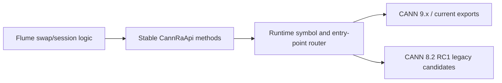

# CANN RA Version Adaptation

## Scope

Flume supports the Host-RA storage path through a runtime adapter instead of
including a specific installed `hccp.h`. This keeps tensor swap, session
lifecycle, and the storage protocol independent of CANN release details.



The adapter recognizes these compatibility dimensions independently:

| Dimension | Current route | Legacy route |
|---|---|---|
| RA symbol spelling | `RaInit`, `RaRegisterMr`, ... | `ra_init`, `ra_register_mr`, ... |
| rdev initialization | `RaRdevInitV2(info, rdev, out)` | `RaRdevInit(mode, notify, rdev, out)` |
| logical-to-physical mapping | `aclrtGetPhyDevIdByLogicDevId` | explicit physical device ID |
| command submission | `RaTypicalSendWr` | `ra_typical_send_wr` or `ra_send_wr`; not required by TCP-control baseline |

Flume always prefers current exports and `RaRdevInitV2`. It selects a legacy
entry only when the preferred symbol is absent. The selected route is reported
as `symbol_profile` and `rdev_init`; storage code contains no CANN-version
branch.

## Read-Only Probe

Build with `FLUME_ENABLE_ROCE_STORAGE=ON`, source the target CANN environment,
and run:

```bash
build-roce/flume-cann-ra-compat-probe
```

This only loads libraries and resolves symbols. It does not select an NPU,
create a QP, register HBM, or send traffic. A complete symbol surface for the
TCP-control baseline reports:

```text
cann_ra_symbol_probe=passed
cann_ra_compat=unqualified
symbol_profile=modern-camelcase|legacy-lowercase|mixed
rdev_init=rdev-init-v2|rdev-init-legacy
physical_device_lookup=available|explicit-required
command_posting=not-required
abi_profile=hccp-reduced-v1
abi_qualified=no
hardware_gate=required
```

Use `--require-command-posting` only for the optional `npu-ra` control mode.
The primary TCP-control storage path deliberately does not require RA SEND,
doorbell, or ACL command-buffer APIs.

## Physical Device Fallback

When `physical_device_lookup=explicit-required`, pass the physical device ID
separately from the ACL logical device ID:

```bash
flume-roce-swap-smoke \
  --device <logical-device> \
  --physical-device <physical-device> \
  ...
```

Library users set `npu_physical_device_valid=1` and
`npu_physical_device=<physical-device>` in
`flume_roce_storage_options_t`. The default remains runtime mapping, which is
safer when visible-device remapping is active.

## ABI Safety Boundary

Symbol presence does not prove structure-layout compatibility, so this probe
never reports ABI compatibility as passed. Flume keeps its
minimal HCCP declarations in one reduced ABI header and statically compares
them with the available public HCCP source fixture. Local fixtures cover both
modern and legacy symbol/entry routing. A new CANN package is accepted for
payload use only after the read-only probe passes and a real QP/MR/RDMA smoke
completes with checksum agreement.

The public CANN 8.2 RC1 `cann-hccl` source tag does not contain the packaged
HCCP RA headers or `libra.so` export table. Therefore the 8.2 route is prepared
in code but remains hardware-qualified, not inferred solely from a version
string.
