# Flume 实现流程与当前状态总结

日期：2026-08-05  
项目：Flume: Host-Bypass Data Path for Ascend NPU  
仓库：`flume-ascend-host-bypass-datapath`

## 1. 一句话结论

Flume 当前已经完成一个可本地回归、可 Ascend 真机验证的初步实现：

- 无 NPU 环境：可以验证 storage control plane、mock pread、sim HBM copy、sim collective、sim P2P send/recv、sim A3 symmetric memory 生命周期。
- Ascend 真机环境：已经验证 `root-info` 和 `init-all` 初始化路径可跑通 base HCCL AllReduce / AllGather。
- Stage 2 P2P baseline：已经在 Host A HCCS_SW pair A 跨 HCCS_SW die 对上验证 `HcclSend` / `HcclRecv` 的 rank0 HBM -> rank1 HBM P2P copy，结果 `p2p_copy=on`。
- Stage 2 HCOMM resource probe：已经实现并在 CANN 8.5 真机上验证 `flume_hcomm_channel_probe` / `flume_hcomm_channel_probe_ex` 和 `--run-hcomm-channel-probe`，用于验证 HCCL Buffer、CPU_TS/AICPU_TS thread resource、可选 thread export、rank graph / legacy descriptor、可配置 engine/protocol 的 Channel acquire 和远端 HCCL Buffer 查询；默认只证明 channel resource，严格 AICPU thread-export 检查需要显式加 `--hcomm-require-thread-export`，CANN 8.5 预期清晰返回 unsupported。
- Stage 2.5 HCOMM payload readiness：已经新增 `--run-hcomm-payload-smoke` 骨架，复用 Channel resource probe 并检查 HCOMM primitive call-shape / 符号；当前预期输出 unsupported / `fallback=hccl-p2p`，不误报真实 payload copy。
- Full matrix：Host B (CANN 9.0) 空闲主机上已通过 HCCS_SW 卡对 required 步；Host A (CANN 8.5) 构建、CTest、sim 和 feature probe 通过，但 smoke 因 NPU 被长任务占满导致 VNIC socket listen 失败，需卡空闲后复测。
- Stage 3A：`storage_hbm=hccl-p2p-staging` 已在 Host B (CANN 9.0) 用本地 SSD 输入文件和 16 MiB byte payload 通过，路径为 `file -> host -> proxy HBM -> HcclSend/HcclRecv -> compute HBM`。
- 仍未实现：AICPU/HCOMM primitive payload copy scheduler，RDMA / NVMe-oF / SPDK -> NPU HBM full direct data path。

当前最重要的工程判断是：

```text
root-info / init-all 是当前首选真机 bring-up 路径
rank-table / HcclCommInitClusterInfo 保留为诊断路径
公开 HCCL Send/Recv 是 Stage 2 已验证 P2P baseline
HCOMM Channel resource probe 已接入，payload backend 是下一阶段下钻目标
```

## 2. 项目目标边界

Flume 要探索的是 Ascend NPU 上的 host-bypass data path。这里的 host-bypass 需要精确定义：

| 维度 | 当前含义 |
| --- | --- |
| host 是否参与初始化 | 参与。host 负责 CANN/HCCL 初始化、rank 建链、任务提交、日志和错误诊断。 |
| 数据 payload 是否经过 host memory staging | 当前 HCCL collective 和 HCCL P2P smoke 不经过 host memory staging。H2D/D2H 只用于初始化测试数据和校验结果。 |
| 是否已经实现存储到 HBM full direct | 尚未实现。当前 storage path 只有 mock/sim 和未来接口形状。 |
| 是否已经实现 HCOMM Channel backend | 已实现 resource probe，尚未实现 AICPU/HCOMM primitive payload copy。当前公开 HCCL `HcclSend` / `HcclRecv` 仍是已验证 payload baseline。 |
| 是否追求上层无感知 | 是未来方向。当前先保证 C ABI、buffer、IO、工具和诊断闭环。 |

Flume 与 HCCL 的关系必须清楚：HCCL 已经能做 NPU tensor 通信的 host-memory-bypass，Flume 不把 AllReduce/AllGather 当作差异化工作。当前 HCCL collective 和 P2P smoke 的意义是建立 baseline、fallback 和诊断闭环；Flume 的差异化目标是把 **storage block -> HCCL/HCOMM-visible memory -> NPU HBM** 这条 HCCL 不负责的路径做成稳定 runtime。

| 能力 | HCCL 状态 | Flume 当前作用 | Flume 下一步 |
| --- | --- | --- | --- |
| AllReduce / AllGather | 已有成熟 API | 包装成 smoke/fallback，验证 CANN 环境 | 不重复造 collective |
| HBM -> HBM P2P | `HcclSend` / `HcclRecv` 已可用 | Stage 2 baseline 已通过 | 对比 HCOMM payload backend |
| HCOMM Channel | HCOMM 有低层资源接口 | resource probe 已在 CANN 8.5 通过 | 实现 primitive payload microcopy |
| HCOMM payload | HCOMM 有 primitive 符号和 on-thread 模型 | readiness smoke 已能报告 unsupported/fallback | 实现 custom-op/AICPU scheduler |
| Storage -> HBM | HCCL 不覆盖 | mock/sim API 形状已具备 | storage proxy，再探索 RDMA/storage direct |

非目标也很重要：

- 当前不宣称等价于 NVIDIA GPUDirect Storage。
- 当前不宣称存储节点可以直接成为 HCCL rank。
- 当前不宣称 host 完全退出控制面。
- 当前不把 Runtime host staging 当目标路径，只作为 correctness / performance baseline 候选。

## 3. 总体实现路线

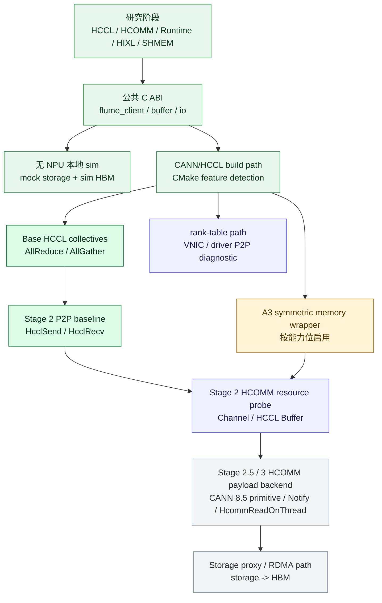

## 4. 代码实现分层

```mermaid
flowchart TB
    classDef api fill:#e8f7ed,stroke:#2f8f46,color:#12351d;
    classDef sim fill:#eef2ff,stroke:#4f46e5,color:#1e1b4b;
    classDef hw fill:#fff5d6,stroke:#b7791f,color:#4a3200;
    classDef future fill:#f3f4f6,stroke:#8b949e,color:#24292f;

    App["应用 / 框架适配层"]:::api
    Flume["libflume C ABI"]:::api
    IO["flume_io_t<br/>wait / status / bytes / checksum / error"]:::api

    subgraph API["当前公开 API"]
        Pread["flume_pread_async"]:::api
        Copy["flume_hbm_copy_async"]:::api
        Coll["flume_allreduce_async<br/>flume_allgather_async"]:::api
        P2PApi["flume_p2p_send_async<br/>flume_p2p_recv_async"]:::api
        A3Api["flume_a3_* wrappers"]:::api
    end

    subgraph Local["无 NPU 本地可测 backend"]
        Agent["StorageAgent TCP"]:::sim
        Posix["POSIX file backend"]:::sim
        SimHbm["FLUME_BUFFER_SIM_HBM"]:::sim
        SimComm["FLUME_BUFFER_SIM_HCCL_COMM"]:::sim
        SimCollective["sim collective pending world"]:::sim
        SimP2P["sim P2P paired pending world"]:::sim
        SimA3["sim A3 symmetric window"]:::sim
    end

    subgraph Ascend["Ascend 真机 backend"]
        HcclAttach["flume_attach_hccl_comm"]:::hw
        HcclColl["HcclAllReduce / HcclAllGather"]:::hw
        HcclP2P["HcclSend / HcclRecv"]:::hw
        StreamWait["aclrtSynchronizeStream"]:::hw
        A3Sym["HcclCommSymWinRegister<br/>ACL VMM mapped HBM"]:::hw
    end

    subgraph Next["下一阶段"]
        HcommCh["HCOMM Channel / Notify"]:::future
        HcclBuf["HCCL Buffer"]:::future
        StorageProxy["storage proxy rank"]:::future
        FullDirect["RDMA / NVMe-oF / SPDK -> HBM"]:::future
    end

    App --> Flume
    Flume --> Pread
    Flume --> Copy
    Flume --> Coll
    Flume --> P2PApi
    Flume --> A3Api
    Flume --> IO

    Pread --> Agent
    Agent --> Posix
    Copy --> SimHbm
    Copy --> SimComm
    Coll --> SimCollective
    P2PApi --> SimP2P
    A3Api --> SimA3

    Coll --> HcclAttach
    P2PApi --> HcclAttach
    HcclAttach --> HcclColl
    HcclAttach --> HcclP2P
    HcclColl --> StreamWait
    HcclP2P --> StreamWait
    A3Api --> A3Sym

    HcclP2P --> HcommCh
    A3Sym --> HcclBuf
    HcommCh --> HcclBuf
    HcclBuf --> StorageProxy
    StorageProxy --> FullDirect
```

## 5. 已实现能力清单

| 模块 | 文件 / 入口 | 当前状态 | 验证方式 |
| --- | --- | --- | --- |
| 公共 C ABI | `include/flume/flume.h` | 已实现 `flume_` 前缀 API | 编译与 CTest |
| StorageAgent | `src/agent/` | TCP 控制面，支持 open / pread / close | `test_mock_pread` |
| framing 协议 | `src/protocol/` | frame 编解码、request id、payload 校验 | `test_protocol` |
| mock pread | `flume_pread_async` | 文件 offset -> buffer，返回 bytes / checksum / error | `test_mock_pread` |
| sim buffer | `FLUME_BUFFER_SIM_HBM` / `SIM_HCCL_COMM` | 无 NPU 本地模拟 HBM 和通信内存 | `test_sim_end_to_end` |
| sim HBM copy | `flume_hbm_copy_async` | sim buffer 间 memcpy / memmove | `flume-sim-demo` |
| sim collective | `flume_allreduce_async` / `flume_allgather_async` | 4-rank pending world，支持配对等待和失败路径 | `test_sim_collectives` / `test_sim_collective_failures` |
| sim P2P | `flume_p2p_send_async` / `flume_p2p_recv_async` | send-first / recv-first 均可，完成前保护 pending IO 和 recv buffer | `test_sim_p2p_copy` |
| backend caps | `flume_get_backend_caps` | 库内结构化能力模型，覆盖 HCCL/HCOMM/payload/storage/fallback 能力 | `test_backend_caps` |
| sim HCOMM probe | `flume_hcomm_channel_probe` | 无 NPU 下覆盖 API、peer rank 校验和 IO 生命周期 | `test_sim_p2p_copy` |
| sim HCOMM payload copy | `flume_hcomm_payload_send_async` / `flume_hcomm_payload_recv_async` | rank-pair HBM copy 语义；send-first / recv-first 均可；完成前保护 pending IO 和 recv buffer | `test_sim_hcomm_payload_copy` / `test_sim_hcomm_payload_failures` |
| storage proxy sim path | `flume_prepare_storage_block_async` / `flume_read_to_hbm_async` | `file offset -> SIM_HCCL_COMM -> SIM_HBM` partial-direct 骨架；真实 Ascend direct path 仍返回 unsupported | `test_sim_hcomm_payload_failures` |
| HCCL build path | `FLUME_ENABLE_HCCL=ON` | 查找 HCCL / HCOMM / ACL / securec / ascendcl | `tools/flume_tool.py ascend-probe` |
| HCCL collective | `HcclAllReduce` / `HcclAllGather` | 已真机验证 root-info 和 init-all 路径 | `--run-hccl-smoke` |
| HCCL P2P baseline | `HcclSend` / `HcclRecv` | 已真机验证 Host A HCCS_SW pair A | `--run-hccl-p2p-smoke` |
| HCOMM Channel resource probe | `HcclGetHcclBuffer` / `HcclRankGraphGetLinks` / `HcclChannelAcquire` / `HcclChannelGetHcclBuffer` | 代码已接入并在 CANN 8.5 真机通过，默认 `engine=auto`；CANN 8.5 缺 `hccl_res_expt.h` 时降级 `cpu-ts` 并只验证 channel resource，`--hcomm-require-thread-export` 才验证 AICPU thread-export 前置能力 | `--run-hcomm-channel-probe` |
| HCOMM payload readiness probe | `flume_hcomm_payload_probe_ex` / `--run-hcomm-payload-smoke` | 骨架已接入，复用 Channel resource 并检查 primitive capability；真实 backend 当前返回 unsupported / `fallback=hccl-p2p`，严格 copy 用 `--hcomm-require-payload-copy`；sim backend 可执行 payload copy | `--run-hcomm-payload-smoke` / `test_sim_hcomm_payload_copy` |
| A3 symmetric wrapper | `flume_a3_*` | 按 CANN/HCCL 能力位编译和运行 | `test_sim_a3_symmetric_memory` / `--run-a3-symmetric-smoke` |
| 工具化测试 | `tools/flume_tool.py` | env / local / ascend-probe / ascend-full-matrix / HCCL smoke / diagnostics | `logs/flume-check-*` |

## 6. 实现流程时间线


## 7. 本地无 NPU 实现流程

没有 NPU 时，最核心的问题是仍然要让 API 形状、buffer 生命周期、异步 IO、错误路径可测试。Flume 通过 sim backend 保持这些语义。

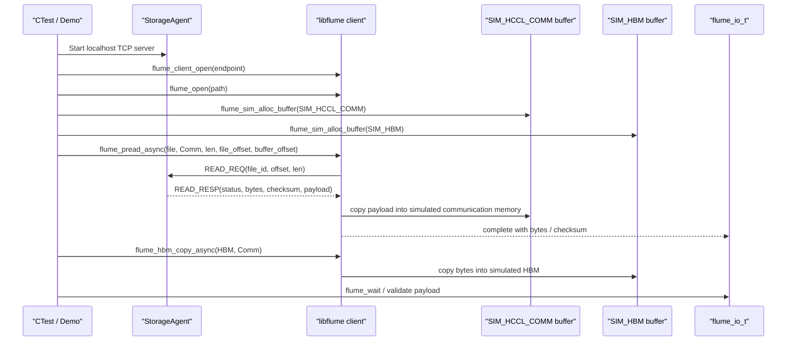

本地 sim collective 和 P2P 不是性能模型，而是上层语义模型：

| sim 能力 | 模拟的真实约束 | 当前测试 |
| --- | --- | --- |
| collective pending world | 多个 rank 都提交后才完成 collective | `test_sim_collectives` |
| collective mismatch failure | rank 间参数不一致时所有 pending IO 失败 | `test_sim_collective_failures` |
| P2P send-first | send 先到时 IO pending，等待 recv | `test_sim_p2p_copy` |
| P2P recv-first | recv 先到时保护 dst buffer，等待 send | `test_sim_p2p_copy` |
| pending release guard | 未完成 IO 或 buffer 不能提前释放 | `test_sim_p2p_copy` |
| A3 symmetric lifecycle | register/deregister 与 buffer 生命周期绑定 | `test_sim_a3_symmetric_memory` |

## 8. Ascend 真机工具链流程

`tools/flume_tool.py` 是当前推荐入口。它的目标是让远端测试者只给少量参数，就能得到结构化日志和诊断。

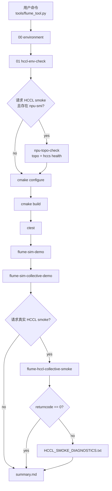

常用命令：

| 目标 | 命令 |
| --- | --- |
| 本地无 NPU 回归 | `python3 tools/flume_tool.py local` |
| Ascend 编译和 sim 回归 | `python3 tools/flume_tool.py --build-dir build-ascend ascend-probe` |
| Base HCCL collective smoke | `python3 tools/flume_tool.py --build-dir build-ascend --run-hccl-smoke --hccl-devices <device-a>,<device-b> ascend-probe` |
| Stage 2 HCCL P2P smoke | `python3 tools/flume_tool.py --build-dir build-p2p --run-hccl-p2p-smoke --hccl-devices <device-a>,<device-b> --hccl-host-ifname <host-ifname> --hccl-host-ip <host-ip> ascend-probe` |
| InitAll 对照 | `python3 tools/flume_tool.py --build-dir build-initall --run-hccl-smoke --hccl-init-mode all --hccl-devices <device-a>,<device-b> ascend-probe` |
| Rank-table 诊断 | `python3 tools/flume_tool.py --build-dir build-ranktable --run-hccl-smoke --hccl-init-mode rank-table --hccl-devices <device-a>,<device-b> ascend-probe` |
| A3 symmetric smoke | `python3 tools/flume_tool.py --build-dir build-a3 --run-a3-symmetric-smoke --hccl-devices 0,1 ascend-probe` |

## 9. HCCL 初始化路径对比

真机调试中最重要的发现是：不同 HCCL 初始化 API 会触发不同建链路径，不应把它们混成一个“P2P 是否可用”的结论。

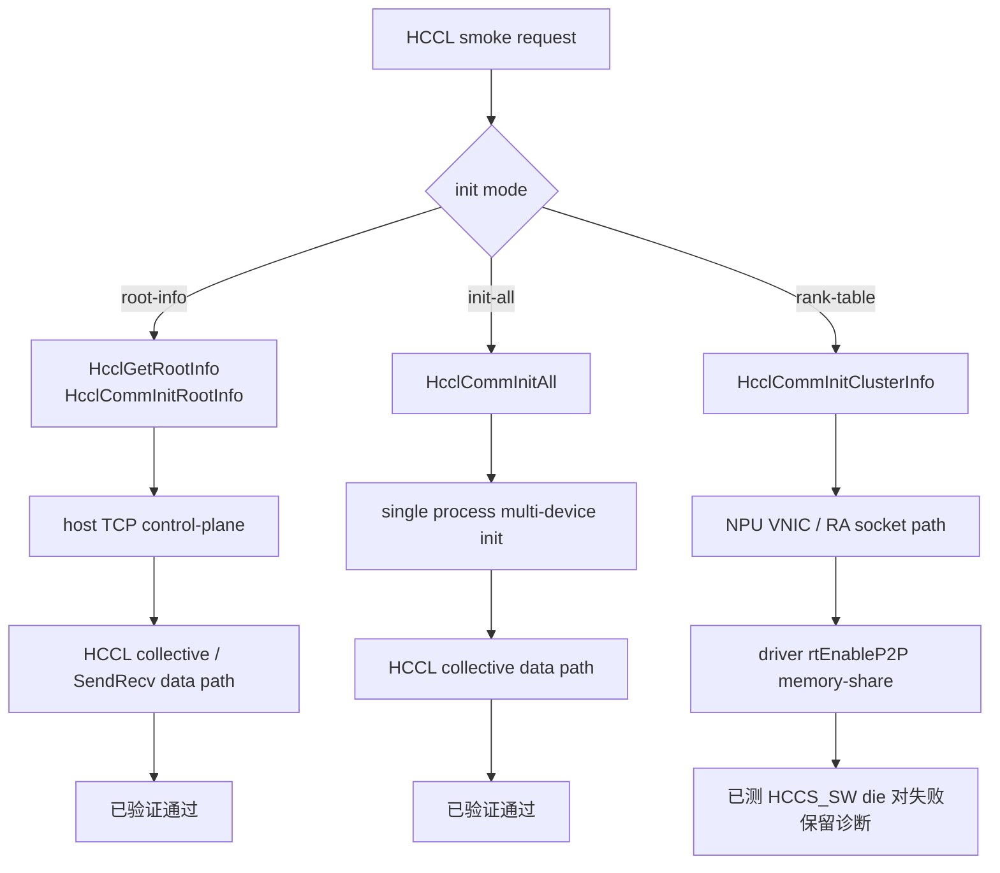

当前结果矩阵：

| 路径 | 初始化 API | 观测链路 | 结果 | 当前定位 |
| --- | --- | --- | --- | --- |
| 官方 HCCL test | `HcclCommInitRootInfo` | host TCP bring-up | 通过 | CANN/HCCL 基础环境可用 |
| Flume root-info | `HcclCommInitRootInfo` | host TCP bring-up | 通过 | 当前默认推荐路径 |
| Flume init-all | `HcclCommInitAll` | 单进程多卡初始化 | 通过 | 对照路径 |
| Flume rank-table | `HcclCommInitClusterInfo` | NPU VNIC + driver P2P memory-share | 失败 | 诊断路径，非默认 |
| Flume Stage 2 P2P | root-info + `HcclSend` / `HcclRecv` | 公开 HCCL P2P API | 通过 | 当前 HBM-HBM P2P baseline |

## 10. 关键问题与解决方式

| 问题 | 现象 | 根因 / 判断 | 解决方式 | 当前状态 |
| --- | --- | --- | --- | --- |
| HCCL symmetric window 编译失败 | `HcclCommSymWindow` / `HcclCommSymWinRegister` 未声明 | CANN/HCCL 版本不一定暴露 A3 trial API | CMake 增加 feature detection，缺失时 wrapper 返回 unsupported | 已修复 |
| 头文件和库可能漂移 | 头文件有符号但运行时库未必导出 | 现场 CANN 可能多套安装或软链指错 | CMake 探针使用 executable compile/link，尽量同时验证头和库 | 已修复 |
| HcclCommInitAll 初期失败 | `HCCL_E_RUNTIME(15)` | 设备绑定、visible remap、初始化路径需要明确 | 补设备映射日志，保留 `init-all` 显式对照 | 已通过 |
| `/etc/hccn.conf` 缺失 | rank-table setup error | 现场不一定有 hccn.conf | 增加 `--hccl-device-ips`，并尝试 `hccn_tool -i <device> -ip -g` | 已修复工具 |
| 192.x.x.x 地址混淆 | 看到 VNIC IP，以为是 host IP 或 RoCE IP | 192.x 是 HCCL RA 返回的 NPU VNIC socket 地址 | 文档解释三层 IP，工具增加 host 参数和诊断摘要 | 已修复认知和工具 |
| rank-table 路径 P2P 超时 | `rt enableP2P fail` / `P2PConnected timeout` | `HcclCommInitClusterInfo` 触发 driver P2P memory-share 策略，和 HCCS 物理健康不是一件事 | 默认切 root-info，rank-table 标为实验诊断 | 已规避 |
| 单机 RoCE 强制无效 | `HCCL_INTRA_ROCE_ENABLE=1` 但 `isUsedRdma[0]` | 单机 rank-table 下 HCCL 按 topology 选 HCCS/VNIC | 工具 warning，文档说明测 RoCE 应用多节点 rank table | 已说明 |
| P2P copy 不能伪装成单端 copy | `HcclSend` / `HcclRecv` 必须配对 | P2P send/recv 有 rank、方向、顺序约束 | 新增显式 `flume_p2p_send_async` / `flume_p2p_recv_async` | 已实现 |
| 无 NPU 难以写准确代码 | 本地无法调用 ACL/HCCL | 上层语义仍可模拟 | sim backend 覆盖 buffer、IO、collective、P2P、A3 生命周期 | 已实现 |

## 11. 三类 IP 的最终解释

真机日志中出现过 host IP、device RoCE IP 和 192.x VNIC IP。它们含义不同：

| IP 类型 | 示例 | 谁使用 | 用途 | 是否应手动配置 |
| --- | --- | --- | --- | --- |
| Host NIC IP | `<host-ip>` | HCCL host coordinator / socket manager | host 侧控制面、root-info bring-up、普通 TCP listen/connect | 可以通过 `--hccl-host-ip` 和 `--hccl-host-ifname` 固定 |
| Device RoCE / HCCN IP | `<hccn-ip>` | HCCL transport / device network | 多节点 RoCE 或 rank table device_ip | rank-table device 模式可通过 `--hccl-device-ips` 提供 |
| NPU VNIC / RA socket IP | `192.x.x.x` | HCCL RA / VNIC internal path | 机内 VNIC/P2P 协商，常见于 rank-table / ClusterInfo 路径 | 通常不由用户配置，也不能当 host IP 使用 |

判断流程：

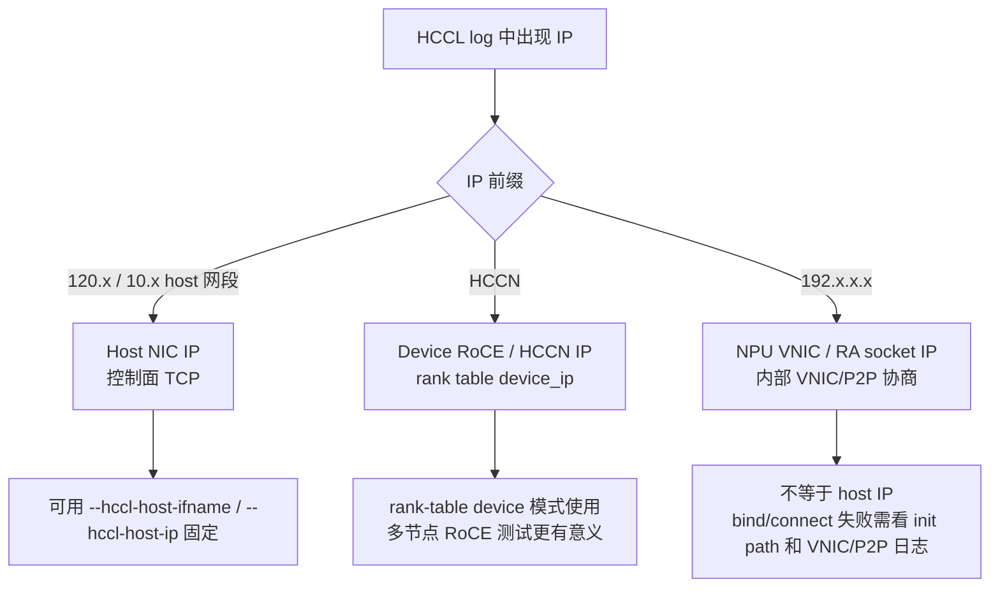

## 12. Stage 2 P2P baseline 实现

Stage 2 最终没有把 P2P copy 塞进旧的 `flume_hbm_copy_async`。原因是公开 HCCL P2P API 是成对通信模型：

```text
rank 0: HcclSend(src_hbm, count, dtype, dest_rank=1, comm, stream)
rank 1: HcclRecv(dst_hbm, count, dtype, src_rank=0, comm, stream)
```

因此 Flume 新增显式 API：

| API | 方向 | 关键参数 | backend |
| --- | --- | --- | --- |
| `flume_p2p_send_async` | local HBM -> peer rank | `src`, `src_offset`, `count`, `data_type`, `dest_rank`, `acl_stream` | sim / HCCL Send |
| `flume_p2p_recv_async` | peer rank -> local HBM | `dst`, `dst_offset`, `count`, `data_type`, `src_rank`, `acl_stream` | sim / HCCL Recv |

本地 sim 行为：

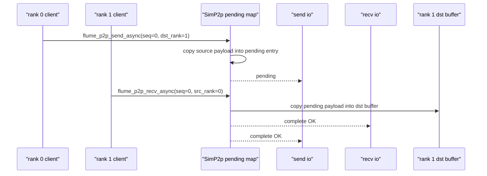

真机 smoke 行为：

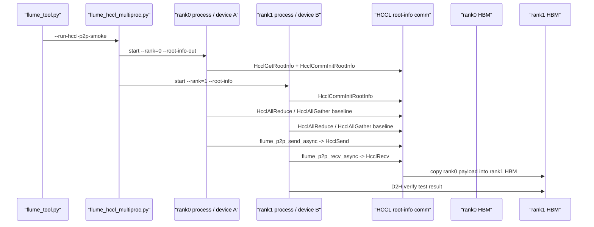

Host A HCCS_SW pair A 已验证结果：

| 项 | 结果 |
| --- | --- |
| commit | `a31c7be` |
| host | Host A |
| devices | `HCCS_SW pair A` |
| topology | 跨 HCCS_SW die 对 |
| init mode | `root-info` |
| collective baseline | 通过 |
| P2P copy | 通过 |
| 关键输出 | `p2p_copy=on` |

## 13. rank-table 失败路径复盘

rank-table 路径一开始看起来像“更接近 device fabric”，但实际在当前单机 HCCS_SW 测试中走进了 HCCL 内部 VNIC + driver P2P memory-share 逻辑。

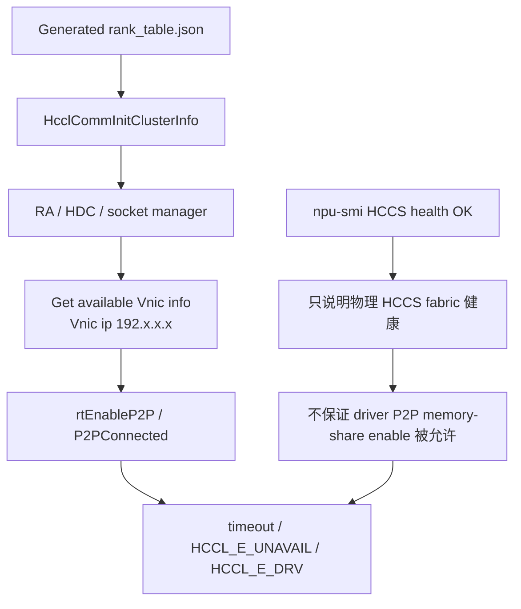

最终判断：

- HCCS fabric 物理层健康，不等于 `rtEnableP2P` memory-share 允许。
- rank-table `HcclCommInitClusterInfo` 失败，不等于公开 `HcclSend` / `HcclRecv` P2P 失败。
- `root-info + HcclSend/HcclRecv` 已经证明同一对 HCCS_SW die 可以完成 HBM -> HBM P2P copy。
- rank-table 当前适合保留为诊断路径，不适合作为默认实现路径。

## 14. 当前验证结果总表

| 验证环境 | 命令 / 路径 | 结果 | 说明 |
| --- | --- | --- | --- |
| macOS / Linux 无 NPU | `python3 tools/flume_tool.py local` | 通过 | CMake、CTest、sim demo、sim collective demo |
| macOS CTest | `ctest --test-dir build-stage2-p2p-local --output-on-failure` | 7/7 通过 | 包含 `sim_p2p_copy` |
| Host A root-info | `--run-hccl-smoke --hccl-devices <device-a>,<device-b>` | 通过 | base AllReduce / AllGather |
| Host A init-all | `--hccl-init-mode all --hccl-devices <device-a>,<device-b>` | 通过 | 单进程对照路径 |
| Host A Stage 2 P2P | `--run-hccl-p2p-smoke --hccl-devices <device-a>,<device-b>` | 通过 | `p2p_copy=on` |
| Host B (CANN 9.0) full-matrix | `ascend-full-matrix --hccl-devices <device-a>,<device-b>` | 通过 | HCCL collective、HCCL P2P、HCOMM Channel、payload readiness/fallback、Stage 3A storage-HBM fallback；未安装 payload package 时 strict payload-copy optional expected negative；package payload-ready 时 strict payload-copy required positive |
| Host B (CANN 9.0) full-matrix | `ascend-full-matrix --hccl-devices <device-c>,<device-d>` | 通过 | 第二组 HCCS_SW 卡对稳定性验证 |
| Host B (CANN 9.0) storage-HBM | `--run-storage-hbm-smoke --storage-smoke-file <local-ssd-file> --storage-smoke-bytes 16777216 --hccl-count 4194304` | 通过 | 本地 SSD 文件切片经 rank0 proxy HBM 和 HCCL P2P 到 rank1 compute HBM，checksum 一致 |
| Host B (CANN 9.0) Stage 3B.3C direct ACL readiness | `--build-hcomm-custom-op --run-hcomm-notify-only-smoke` | 通过预期降级 | `direct_aclrt=on`，custom-op package 缺失时 `stage3b3c_direct_aclrt_loader=unsupported`、descriptor handoff blocked、launch not-attempted |
| Stage 3B.3D no-internal-header canary | `--build-hcomm-custom-op --run-hcomm-notify-only-smoke` | 待真机验证 | 新增 `stage3b3d_no_internal_headers=on` 和 `stage3b3d_direct_aclrt_canary_*` marker；已安装 canary package 时目标为 `stage3b3d_direct_aclrt_canary=passed` |
| Stage 3B.3E HCOMM payload copy | `--build-hcomm-custom-op --run-hcomm-payload-smoke --hcomm-require-payload-copy` | 待真机验证 | 目标 marker 为两 rank passed、`stage3b3e_payload_copy=passed`、direct ACL payload launch/sync passed、`payload_kernel_status=success`、`payload_failure_step=none`、`payload_status_word=0`、`payload_kernel_hcomm_ret=0`、`payload_status_schema=v2`、`payload_status_word_count=8`、`payload_echo=passed`、`payload_primitive_state=completed`、`payload_trace=passed`、`payload_trace_event=kernel-exit`、`payload_trace_result=success`、`payload_desc_batch_tag=default\|custom`、`payload_recv_path=local-buffer\|direct-output`、`payload_semantic_v6=present`、`payload_semantic_v7=present`、`payload_thread_notify_order=...`、`payload_pattern=strict-v1`、source/received/expected checksum match、`payload_verify=passed`、`fallback=none`；缺 payload package/function 时应清晰 unsupported |
| Host A (CANN 8.5) full-matrix | `ascend-full-matrix --hccl-devices <device-a>,<device-b>` | 未完成有效 smoke | NPU 被长任务占满，VNIC socket `<vnic-ip>:<port>` listen 失败；build/CTest/sim/feature probe 通过 |
| Host A / Host B rank-table | `--hccl-init-mode rank-table` | 未通过 | VNIC / `rtEnableP2P` / P2P memory-share 路径问题 |
| A3 symmetric smoke | `--run-a3-symmetric-smoke` | 取决于现场 CANN/HCCL 能力位 | 缺 API 时应返回 unavailable / unsupported |

## 15. 当前项目能做什么

当前 Flume 可以支持三类开发工作：

| 场景 | 能否做 | 当前方式 |
| --- | --- | --- |
| 无 NPU 开发 API 和上层调度 | 可以 | sim backend |
| 验证 HCCL 环境、编译、链接 | 可以 | `ascend-probe` |
| 单机多卡 base HCCL collective | 可以 | `--run-hccl-smoke` |
| 单机多卡 HBM -> HBM P2P copy | 可以 | `--run-hccl-p2p-smoke` |
| 诊断 rank-table / VNIC / HCCN 问题 | 可以 | `--hccl-init-mode rank-table` + diagnostics |
| 验证 A3 symmetric API 是否存在 | 可以 | CMake feature probe + A3 smoke |
| HCOMM Channel resource probe | 可以测试 | `--run-hcomm-channel-probe` |
| HCOMM primitive payload backend | 暂不能 | 下一阶段实现 AICPU/custom-op 数据面 |
| storage RDMA direct into HBM | 暂不能 | 需要 storage proxy / RDMA 注册探索 |
| 计算进程完全无感 allreduce/allgather | 暂不能 | base HCCL 仍需每次 host enqueue |

## 16. 未来方向

### 16.1 Stage 2.5 / Stage 3: HCOMM primitive payload backend

下一步不是替换掉已经验证的 HCCL P2P baseline，也不是继续做 HCCL collective 包装，而是在已经通过的 HCOMM Channel resource probe 之后继续下钻 payload backend。这个阶段开始产生 Flume 区别于 HCCL wrapper 的真实价值：把 HCOMM Channel/HCCL Buffer 变成 Flume 自己可调度的数据面。

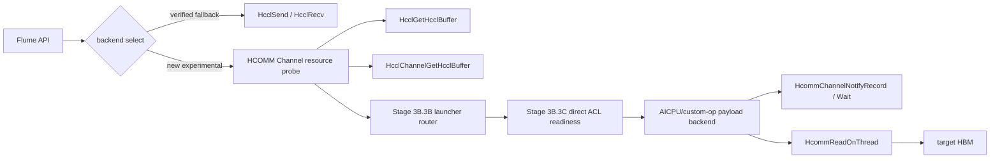

当前已经解决了资源获取的 host 侧入口，后续还需要解决：

| 问题 | 说明 |
| --- | --- |
| HCOMM 接口上下文 | Channel resource probe 已验证 host 侧 acquisition 入口；payload copy 仍需要 CANN 8.5 可用的 on-thread primitive 调度路径；Stage 3B.3B/3C 已开始把 public HCCL launch、direct ACL launch、thread export、HCOMM primitive、custom-op package、descriptor handoff 和 launch 状态拆成可诊断能力。 |
| Channel 生命周期 | 需要明确 endpoint、channel、notify、remote buffer 的创建和销毁边界。 |
| buffer 来源 | 需要验证普通业务 HBM、HCCL Buffer、A3 symmetric mapped HBM 哪些能作为源/目标。 |
| 调度语义 | 对上层继续保留 `send/recv` 或封装成更高层 copy，需要避免伪造 one-sided 语义。 |
| fallback | HCOMM backend 失败时保留已验证 `HcclSend/HcclRecv` 路径。 |

### 16.2 Stage 4: Storage proxy rank

HCOMM primitive payload backend 跑通后，再接 storage proxy：

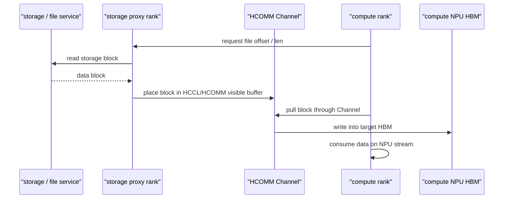

早期 storage proxy 可能仍然在 proxy 侧经过 host memory。只要 compute 侧不再 host staging，就可以标为 partial direct。full direct 需要外部 RDMA 或存储 DMA 能直接访问 NPU HBM 或 activated comm memory。

### 16.3 Stage 5: Full direct storage path

最终目标需要额外条件：

| 条件 | 需要验证的问题 |
| --- | --- |
| 外部 RDMA 注册 NPU HBM | RDMA NIC 或存储 target 是否能注册 / 访问 Ascend HBM 或 comm memory |
| memory export / handle | ACL advanced memory handle 是否能安全给外部设备使用 |
| completion 同步 | RDMA CQE / NVMe completion 如何转成 ACL event、stream ordering 或 HCOMM Notify |
| 一致性 | 外部 DMA 写入后 NPU kernel 读取是否需要 cache flush / barrier |
| 故障恢复 | 链路断开、CQE error、HCCL channel error、rank failure 如何上报 |

## 17. 复现入口

推荐最小复现顺序：

1. 本地开发机：

```bash
python3 tools/flume_tool.py --build-dir build-local local
```

2. Ascend 主机只做编译和 sim：

```bash
source /usr/local/Ascend/ascend-toolkit/set_env.sh
python3 tools/flume_tool.py --build-dir build-ascend ascend-probe
```

3. Ascend 主机 base HCCL：

```bash
python3 tools/flume_tool.py \
  --build-dir build-rootinfo \
  --run-hccl-smoke \
  --hccl-devices <device-a>,<device-b> \
  --hccl-host-ifname <host-ifname> \
  --hccl-host-ip <host-ip> \
  ascend-probe
```

4. Ascend 主机 Stage 2 P2P：

```bash
python3 tools/flume_tool.py \
  --build-dir build-p2p \
  --run-hccl-p2p-smoke \
  --hccl-devices <device-a>,<device-b> \
  --hccl-host-ifname <host-ifname> \
  --hccl-host-ip <host-ip> \
  --hccl-debug-logs \
  ascend-probe
```

成功标志：

```text
hccl collective smoke passed: global_rank_size=2 ... init=root-info ... p2p_copy=on
```

## 18. 总结

当前项目已经从“研究设想”推进到“有可复现工程闭环”的状态：

- **API 闭环**：已经有统一 C ABI、buffer handle、IO handle、状态码和错误信息。
- **本地闭环**：没有 NPU 也能跑完整 mock/sim 回归，适合继续写上层逻辑和调度代码。
- **真机闭环**：root-info 和 init-all 已验证 base HCCL collective，Stage 2 `HcclSend` / `HcclRecv` P2P copy 已验证跨 HCCS_SW HBM -> HBM；HCOMM Channel resource probe 已在 CANN 8.5 真机通过，probe 成功语义已收紧为 channel resource，不再把缺 thread-export 的 CANN 8.5 误报成 AICPU thread-export-ready。
- **诊断闭环**：工具能够收集环境、topology、HCCL 日志、rank-table、diagnostics，已经能区分 host TCP、device RoCE、NPU VNIC、driver P2P policy。
- **路线闭环**：rank-table 失败路径被降级为诊断分支，公开 HCCL P2P 被确认为当前可靠 baseline，Stage 3B.3B/3C launcher router 和 direct ACL readiness 已在 Host B 真机把 CANN/HCOMM 版本差异变成可诊断选择，下一步可以在不破坏 fallback 的前提下实现 AICPU/HCOMM primitive payload backend。

未来的核心工作是沿着这条顺序推进：

```text
HcclSend/HcclRecv verified baseline
  -> HCOMM Channel resource probe
  -> HCOMM launcher capability router
  -> direct ACL custom-op loader / descriptor handoff
  -> CANN 8.5 HCOMM primitive payload microcopy
  -> storage proxy rank
  -> RDMA / NVMe-oF / SPDK direct registration
  -> storage -> NPU HBM full direct path
```

这条路线的关键优点是每一步都有已验证 fallback 和可比较结果，不需要在未证明的底层接口上一次性赌完整方案。
