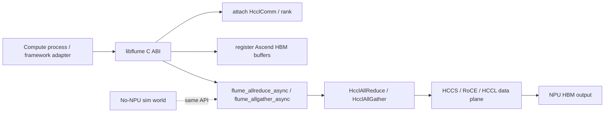

# 单机多卡 HBM 通信与 Base HCCL 可行性分析

日期：2026-08-03

## 结论

Base HCCL 可以用于单机多卡 AllReduce / AllGather，且标准用法下输入输出都是 NPU device/HBM buffer，数据搬运不需要经过 host 内存。

这说明 **HCCL 本身已经支持 NPU tensor 通信的 host-memory-bypass**。如果问题只是“1 卡算子进程的 HBM tensor 和 2 卡算子进程的 HBM tensor 交互”，HCCL 是现成主路径；Flume 不应该重复实现这部分通信算法。

Flume 的核心价值在于 HCCL 没覆盖的另一半：**远端存储数据如何进入 NPU HBM，并接入 HCCL/HCOMM 已经存在的 NPU 数据面**。因此本文的 base HCCL collective、`HcclSend` / `HcclRecv` P2P smoke 和 HCOMM Channel probe 都是 baseline / fallback / 下钻验证，不是最终产品边界。

| 问题 | HCCL 是否解决 | Flume 应如何处理 |
| --- | --- | --- |
| NPU HBM tensor AllReduce / AllGather | 是 | 复用，不重做 |
| NPU HBM tensor Send/Recv | 是，若公开 P2P API 可用 | 复用为 Stage 2 baseline |
| host 是否参与每次通信任务提交 | 参与 | Flume 不能把 HCCL 包装成完全 hostless |
| storage block 如何进 NPU HBM | 否 | Flume 的核心目标 |
| CANN 8.5/高版本能力差异 | 不提供统一上层 fallback | Flume 做 feature probe、fallback 和诊断 |

如果进一步要求“尽量不经过 HCCL 内部通信 buffer 中转”，Atlas A3 HCCS 场景可以使用 HCCL 对称内存窗口：用 ACL advanced memory API 预留虚拟地址、申请 HBM 物理内存并映射，再调用 `HcclCommSymWinRegister`。这条路径仍需要 host 在每次 collective 时 enqueue 任务，但 collective 的输入输出可以是注册后的业务 HBM 窗口。

但如果目标被严格定义为：

```text
host 只做初始建链
每张卡有独立通信进程长期管理 HBM
计算进程不调用 HCCL collective，也不参与每次通信调度
后续 AllReduce / AllGather 完全由通信进程或 device resident engine 自主执行
```

那么 base HCCL public API 不能直接满足。公开 HCCL collective API 仍然要求拥有 `HcclComm`、device pointer 和 `aclrtStream` 的进程在每次 collective 时调用 `HcclAllReduce` / `HcclAllGather` 进行任务下发。

更准确的判断是：

- **能做到**：计算进程或 AI 框架自己持有 HBM，并通过 HCCL 在 stream 上发起 AllReduce / AllGather；数据面走 HCCS/RoCE/PCIe/通信引擎，不做 host staging。
- **部分能做到**：通过 HCCL op expansion mode、AICPU/AIV/CCU、自定义 HCOMM 算子，把通信编排和搬运更多放到 device 侧，host 只负责提交通信任务。
- **base HCCL 不能直接做到**：独立通信进程替计算进程透明管理 HBM 并完成 collective，且计算进程完全不调用 HCCL/不提交通信任务。

## 当前仓库实现

当前实现先落在“base HCCL collective wrapper”这一层：



已实现：

- `flume_attach_hccl_comm` 保存外部已有 `HcclComm`。
- `flume_register_buffer(..., FLUME_BUFFER_ASCEND_HBM)` 在 `FLUME_ENABLE_HCCL=ON` 时接受真实 Ascend HBM 指针。
- `flume_allreduce_async` / `flume_allgather_async` 对真实 Ascend HBM 指针直接调用 `HcclAllReduce` / `HcclAllGather`。
- `flume_p2p_send_async` / `flume_p2p_recv_async` 在能力位 `FLUME_HAVE_HCCL_P2P=1` 时调用公开 `HcclSend` / `HcclRecv`，当前 smoke 可测 rank0 HBM 到 rank1 HBM 的配对拷贝。
- `flume_a3_register_symmetric_memory` / `flume_a3_deregister_symmetric_memory` 已按能力位封装 A3 `HcclCommSymWinRegister` / `HcclCommSymWinDeregister`，缺失时返回 unsupported。
- `flume_a3_set_memory_range` / `flume_a3_activate_comm_memory` / `flume_a3_deactivate_comm_memory` / `flume_a3_unset_memory_range` 已作为 A3 comm memory activation 薄封装，依赖 CMake 探测到对应 HCCL 试用接口。
- `flume_attach_sim_comm` 和 sim collective world，可以在无 NPU Mac/Linux 上验证 4-rank AllReduce / AllGather 的 API、等待和结果布局。
- `flume-hccl-collective-smoke` 可选真机程序，用于单机多卡 HBM collective smoke；加 `--a3-symmetric` 后在 ACL VMM 和 HCCL symmetric window 均可用时走 mapped HBM + symmetric window。

已验证或已接入但边界明确：

- Host A HCCS_SW pair A 上，root-info 和 init-all HCCL collective 已通过。
- Host A HCCS_SW pair A 上，公开 HCCL `HcclSend` / `HcclRecv` 的 rank0 HBM -> rank1 HBM P2P copy 已通过，`p2p_copy=on`。
- CANN 8.5 上 HCOMM Channel resource probe 已通过：`HCCL Buffer`、`CPU_TS` thread resource、Channel acquire、远端 HCCL Buffer 查询可作为下一步 payload backend 的资源入口。
- CANN 8.5 缺 `hccl_res_expt.h` / thread export 是正常版本差异；严格 thread-export 检查应返回 unsupported，不代表主路径失败。
- 本地无 NPU 环境已实现结构化 backend caps、HCOMM payload pair-copy sim backend、storage partial-direct sim path 和 `ascend-full-matrix` 工具入口。

仍未实现：

- 真实 HCOMM primitive / custom-op 版本的 HBM-HBM payload copy；当前真实 Ascend backend 只实现 HCOMM Channel resource probe、payload readiness 诊断和公开 HCCL P2P fallback。
- 独立通信 daemon 与计算进程跨进程共享 HBM。
- storage RDMA/NVMe-oF 直接写入 NPU HBM 或 activated comm memory。

## 证据

### HCCL public collective API 是 host 侧 enqueue 接口

`refer/cann-src/hccl/include/hccl.h` 中：

- `HcclAllReduce(void *sendBuf, void *recvBuf, ..., HcclComm comm, aclrtStream stream)`
- `HcclAllGather(void *sendBuf, void *recvBuf, ..., HcclComm comm, aclrtStream stream)`

这说明 base collective 的调用者必须持有：

- 本 rank 的 `HcclComm`。
- 本 rank 可访问的 device buffer 指针。
- 本 rank 的 `aclrtStream`。

### 单机多卡 standard sample 是“一卡一线程/一 rank”

HCCL 示例 `examples/02_collectives/01_allreduce/main.cc` 和 `03_allgather/main.cc` 的流程是：

```text
aclInit
aclrtSetDevice
aclrtMalloc(sendBuf / recvBuf)
HcclCommInitRootInfo
aclrtCreateStream
HcclAllReduce / HcclAllGather
flume_wait -> aclrtSynchronizeStream
```

这些示例为了初始化和校验使用 H2D/D2H，但 collective 本身的输入输出是 device buffer。

### HcclCommInitAll 支持单进程多 NPU，不是跨进程通信 daemon

`HcclCommInitAll` 文档说明：单机通信场景中，通过一个进程统一创建多张卡的通信域，其中一张卡对应一个线程。

这可以用于单进程多卡测试，但它不是“每张卡一个独立通信进程托管 HBM”的服务模型。

### HCOMM 提供更底层的数据面能力

HCOMM 暴露了：

- Endpoint / Channel / Notify。
- `COMM_PROTOCOL_HCCS`、`COMM_PROTOCOL_ROCE`、`COMM_PROTOCOL_PCIE` 等协议类型。
- `COMM_ENGINE_CPU`、`COMM_ENGINE_AICPU`、`COMM_ENGINE_AIV`、`COMM_ENGINE_CCU` 等通信引擎。
- `HcommReadOnThread`、`HcommWriteOnThread`、`HcommWriteReduceOnThread`、`HcommChannelNotify*` 等数据面接口。

这说明 HCOMM 能支撑 device-side / channel-based 数据搬运编排，但它属于通信算子开发接口，不是对上层应用透明的独立通信服务。

### 自定义算子仍需要 host launch，但数据面在 AICPU/CCU/AIV 执行

HCCL 自定义 P2P 示例中，Host 侧负责：

- 获取 comm name / rank / rank size。
- 获取 thread/channel。
- 获取本端和远端 HCCL buffer。
- 下发 AICPU kernel。

AICPU 侧再调用：

- `HcommLocalCopyOnThread`
- `HcommReadOnThread`
- `HcommChannelNotifyRecordOnThread`
- `HcommChannelNotifyWaitOnThread`

这条路径可以减少 host 参与数据面，但仍不是 host 完全不参与每次通信任务提交。

### 零拷贝/对称内存有硬件与模式限制

`HcclCommSetMemoryRange` / `HcclCommActivateCommMemory` 是试用接口，文档标明不支持生产环境，主要支持 Atlas A3。

`HcclCommSymWinRegister` 可以把业务内存注册为对称内存窗口，使 HCCL 在支持的 collective 中直接使用该内存，减少 HCCL buffer 中转。但约束较强：

- A3：HCCS 场景，支持 AllGather / ReduceScatter / AllReduce / AllToAll。
- 950：URMA 场景，文档中 AllGather 支持更明确。
- A2 / 910B：不支持该对称内存接口。
- 仅支持 AI CPU 展开模式。
- 所有 rank 需要同时调用注册/解注册。

当前代码的 A3 smoke 与文档示例保持同样顺序：

```text
HcclCommInitRootInfoConfig
aclrtCreateStream
aclrtReserveMemAddress
aclrtMallocPhysical
aclrtMapMem
flume_a3_register_symmetric_memory
flume_allreduce_async / flume_allgather_async
flume_wait -> aclrtSynchronizeStream
flume_a3_deregister_symmetric_memory
aclrtUnmapMem / aclrtFreePhysical / aclrtReleaseMemAddress
```

## 对你的真机场景的判断

### 场景 A：计算进程直接使用 HCCL

```text
compute process rank0 owns NPU0 HBM
compute process rank1 owns NPU1 HBM
...
each process calls HcclAllReduce / HcclAllGather on its stream
```

这是 base HCCL 正常模型。可以先测。

语义上：

- host 参与 init、任务下发、stream 同步。
- 数据不经过 host memory。
- 链路由 HCCL 根据拓扑选择 HCCS / RoCE / PCIe 等。

这已经满足大多数训练框架所谓“tensor 通信不经过 host memory”的含义。它不等价于“host 不参与控制面”，也不等价于“存储数据可以直接进入 HBM”。

### 场景 B：单进程多卡通信线程管理 HBM

```text
one process
  thread0 -> NPU0
  thread1 -> NPU1
  ...
```

`HcclCommInitAll` 或 `HcclCommInitRootInfo` 示例支持这个方向。它适合做单机 HBM-HBM baseline。

但这不是“计算进程无感”，因为同一进程仍要显式调用 HCCL 或包装后的 bridge API。

### 场景 C：每卡一个独立通信进程托管 HBM，计算进程无感

```text
compute process
  no HCCL call
  no comm stream ownership
  uses some shared HBM view

comm process per NPU
  owns HCCL comm
  owns or imports HBM
  executes collective
```

base HCCL 没有直接提供这种模型。要做需要额外解决：

- 计算进程和通信进程之间的 HBM 共享或导入。
- device pointer 在不同进程 VA 下的有效性。
- compute stream 与 comm stream 的跨进程同步。
- collective 调用顺序与计算图调度。
- 错误传播、超时、rank 失效恢复。
- 对上层框架 API 的拦截或适配。

这已经超出 base HCCL public collective 的范围，更像一个 FLUME runtime/daemon + HCOMM custom backend。

## 建议真机第一阶段

先不要从“独立通信进程”开始。建议按三步推进：

1. **Base HCCL baseline**
   - 每卡一进程或每卡一线程。
   - 计算进程直接调用 `HcclAllReduce` / `HcclAllGather`。
   - 验证单机多卡 HBM-HBM correctness、带宽、latency、CPU usage。

2. **Device-side expansion baseline**
   - 尝试 `HcclCommConfig.hcclOpExpansionMode` 或环境变量 `HCCL_OP_EXPANSION_MODE`。
   - 对比 Host CPU / AICPU / AIV / CCU 模式。
   - 目标是证明 host 不参与数据编排或尽量少参与编排。

3. **Bridge API proxy**
   - 我们的 `flume_allreduce_async` / `flume_allgather_async` 已经包装 base HCCL。
   - A3 场景可先打开 `flume_a3_register_symmetric_memory`，验证注册后业务 HBM 窗口可直接作为 collective 输入输出。
   - `flume_hcomm_channel_probe` 已接入 HCOMM Channel resource acquisition；`flume_hcomm_payload_send_async` / `flume_hcomm_payload_recv_async` 已有本地 sim backend；真实 AICPU/HCOMM primitive payload scheduler 仍待实现。
   - 先让计算进程显式调用 bridge API，但隐藏 HCCL 细节。
   - 再探索是否能通过框架 plugin/hook 做“上层无感”。

只有在这三步之后，再探索真正的通信 daemon / 共享 HBM / 跨进程 stream sync。

## 对本项目的实现方向

短期已实现：

```text
flume_attach_hccl_comm
flume_register_buffer(FLUME_BUFFER_ASCEND_HBM)
flume_allreduce_async
flume_allgather_async
flume_p2p_send_async / flume_p2p_recv_async
flume_hcomm_channel_probe
flume_get_backend_caps
flume_hcomm_payload_send_async / flume_hcomm_payload_recv_async  # sim backend
flume_prepare_storage_block_async / flume_read_to_hbm_async      # sim partial-direct
```

短期下一步：

```text
CANN 8.5 HCOMM primitive payload scheduler
真实 storage proxy -> HCCL/HCOMM/RDMA backend
```

其中 `flume_allreduce_async` 和 `flume_allgather_async` 第一版直接调用 base HCCL public API。这样做的价值不是替代 HCCL，而是最快在真机上验证：

- HCCL 环境。
- 单机多卡通信域。
- HBM 输入输出。
- stream ordering。
- 是否出现 host staging。

中期再加：

```text
FLUME_HCCL_OP_EXPANSION_MODE=host|aicpu|aiv|ccu
FLUME_HCCL_SYM_MEM=0|1  // A3 symmetric window 已有 API 和 smoke，需真机数据补证
FLUME_REQUIRE_NO_HOST_STAGING=1
```

长期再研究：

- HCOMM custom op。
- HBM 跨进程共享。
- 计算进程与通信进程分离。
