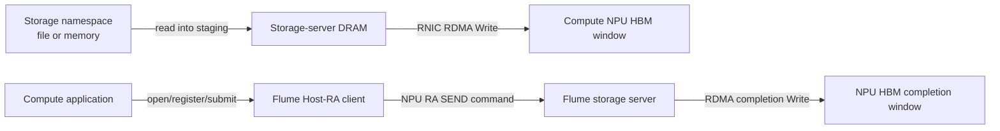

# Stage 4 Host-RA Storage Baseline

## Goal

Stage 4A/4B establishes the first real external-storage-to-Ascend-HBM path.
The compute host performs setup and submits each command, but payload bytes do
not pass through compute-host DRAM.



This stage bypasses compute-host payload staging. It does **not** bypass the
storage server CPU/DRAM and does not claim SSD-to-HBM peer DMA.

## Clean-room boundary

The implementation is independent Flume code. Its ABI declarations were
reduced from the open CANN HCCP and runtime API headers under `refer/cann-src`
and its storage endpoint uses standard `libibverbs`. No NDS source code was
copied or adapted.

## Implemented flow

| Phase | Compute side | Storage side |
|---|---|---|
| Capability load | Dynamically resolve public CANN runtime, ACL, and RA symbols | Verify `libibverbs` at configure time |
| Resource setup | Select logical NPU, resolve physical ID, open HCCP net service, create NPU RC QP | Create PD/CQ/RC QP |
| Registration | Allocate/register command and completion HBM; register application HBM per request | Register command receive, completion source, and staging buffers |
| Bootstrap | TCP sends NPU QP endpoint and completion HBM descriptor | TCP returns server QP endpoint and namespace limits |
| Connect | `RaTypicalQpModify` | `ibv_modify_qp` to RTR/RTS |
| Command | Encode protocol v2 command in HBM, `RaTypicalSendWr`, `rtRDMADBSend` | `ibv_post_recv` receives command from NPU |
| Read payload | HBM is exposed with remote-write access | file/memory to server staging, then RDMA Write to HBM |
| Completion | Poll completion HBM and match request ID | RDMA Write completion record to the registered HBM window |

Protocol v2 keeps only bootstrap on TCP. Commands and completions are no longer
carried by the host TCP connection.

## Capability and fallback behavior

The CANN libraries are loaded at runtime from `libra.so`, `libruntime.so`, and
`libascendcl.so`. A missing library or required symbol returns a precise
`unsupported` marker instead of producing a build failure on Mac or ordinary
Linux. A real RA/runtime failure after capabilities are loaded is reported as
a `roce_storage=backend-failed` backend error.

Current markers:

```text
roce_storage=host-ra-passed
roce_protocol=flume-roce-v2
compute_host_payload=not-used
compute_host_post=used
command_path=npu-ra-send
completion_path=rdma-write-to-npu-hbm
payload_path=storage-host-staging-to-npu-hbm
fallback=none
```

## Local validation

```bash
cmake -S . -B build-stage4 \
  -DFLUME_BUILD_TESTS=ON \
  -DFLUME_ENABLE_HCCL=OFF \
  -DFLUME_ENABLE_ROCE_STORAGE=ON
cmake --build build-stage4 -j 8
ctest --test-dir build-stage4 -R 'roce_storage_protocol|cann_ra_loader' \
  --output-on-failure
```

The equivalent helper configuration is:

```bash
python3 tools/flume_tool.py --build-dir build-stage4 \
  --enable-roce-storage ascend-probe
```

The protocol test covers wire validation and lifecycle transitions. The loader
test covers ABI guards and fail-closed behavior when CANN libraries are absent.

## Hardware validation topology

Run a normal Flume agent for the public API client handle, then the storage
server on Host A and the NPU client on compute Host C. Replace placeholders
with lab values; do not commit them.

```bash
# Existing Flume control agent on Host C.
build-stage4/flume-store-agent --listen 127.0.0.1:18080 --root /tmp

# Host A: SSD/file owner and standard RNIC endpoint.
build-stage4/flume-roce-storage-server \
  --listen <control-listen-ip> \
  --storage-file <test-file> \
  --verbs-device <storage-rnic-device> \
  --control-port <control-port>

# Host C: NPU HBM owner and HCCN/RA endpoint.
build-stage4/flume-roce-storage-client \
  --agent-endpoint 127.0.0.1:18080 \
  --storage-server <storage-server-ip> \
  --npu-rnic-ip <npu-hccn-ip> \
  --device <logical-device-id> \
  --control-port <control-port> \
  --bytes 4194304
```

Acceptance requires `roce_storage_smoke=passed`, matching server/client
checksums, the protocol-v2 markers above, and no TCP command/completion path in
debug output. The final D2H copy in the smoke is verification only and occurs
after the transfer completes.

## Remaining work

1. Validate CANN 8.5 and 9.0 RA ABI/symbol availability and capture per-step
   failures without publishing lab addresses.
2. Add queue depth greater than one, request cancellation, and CQ-based NPU
   completion handling.
3. Add AICPU/AIV command posting so the compute host is removed from the
   per-I/O submission path.
4. Replace storage-server POSIX staging with SPDK/NVMe-oF or a supported peer
   DMA path. Only that later stage can claim storage-side payload bypass.
