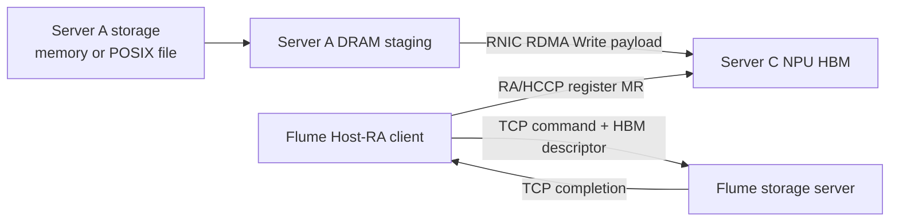

# Stage 4 Host-RA Direct-Storage Baseline

## Status

**Implemented, statically verified, hardware validation pending.**

The push-first routing extension, including a CPU-server/NPU-data-mover sender
and a transparent three-node control proxy, is documented in
[`stage-4-push-routing.md`](stage-4-push-routing.md).

The default baseline uses push mode with TCP commands and completions while payload bytes
use RDMA between the data-mover RNIC and a registered NPU HBM window. The
older NPU-RA command path remains available as an experimental mode.
Pull is a reserved API/protocol mode and currently returns unsupported.

## Boundary



This proves **compute-host payload bypass** when hardware validation passes:
the compute CPU creates resources and submits control messages, but it does not
stage or H2D-copy payload bytes. Server A still reads storage into its own DRAM,
so this stage does not claim SSD-to-HBM peer DMA or full end-to-end host bypass.

## Control Modes

| Mode | Command | Completion | Payload | Status |
|---|---|---|---|---|
| `tcp` (default) | TCP | TCP | RNIC RDMA Read/Write to NPU HBM | Primary hardware baseline |
| `npu-ra` | NPU RA SEND | RDMA Write to completion HBM | RNIC RDMA Read/Write to NPU HBM | Preserved experimental path |

TCP control deliberately removes command HBM, completion HBM,
`RaTypicalSendWr`, and `rtRDMADBSend` from the minimum proof. It still requires
the hard path: RA/HCCP QP creation, HBM MR registration, RC-QP connection, and
standard-verbs RDMA into the returned HBM address/rkey.

## Implemented Flow

| Phase | Compute server C | Storage server A |
|---|---|---|
| Capability | Load RA/ACL/runtime QP+MR symbols | Require standard `libibverbs` |
| Resources | Select NPU, open net service, create RA RC QP | Create PD/CQ/RC QP |
| Bootstrap | Send NPU endpoint over TCP | Return RNIC endpoint and namespace limits |
| Connect | `RaTypicalQpModify` | `ibv_modify_qp` through RTR/RTS |
| Request | Register application HBM and send `offset/len/addr/rkey` over TCP | Decode and validate command |
| Payload | No compute-host payload buffer | memory/POSIX -> staging -> RDMA Write/Read |
| Completion | Receive TCP completion | Wait local CQ, then send status/checksum |
| Verification | D2H read after completion, smoke only | Server checksum is returned as metadata |

The dynamic CANN adapter separates QP/MR core capability from optional NPU
command posting. It routes current CamelCase RA exports and legacy lowercase
exports, and falls back from `RaRdevInitV2` to `RaRdevInit` when necessary.
Missing core symbols produce `unsupported`; a runtime failure after successful
capability loading produces a backend failure. CANN 8.2 RC1 and 9.0 therefore
share the same storage/session implementation. See
[`cann-ra-version-adaptation.md`](cann-ra-version-adaptation.md).

## Clean-Room Boundary

The implementation is independent Flume code. Its minimal ABI declarations
are checked against the public CANN/HCCP source fixture under `refer/cann-src`;
the storage endpoint uses standard libibverbs. No NDS implementation code is
copied or adapted.

## Local Validation

```bash
cmake -S . -B build-local-roce \
  -DFLUME_BUILD_TESTS=ON \
  -DFLUME_ENABLE_HCCL=OFF \
  -DFLUME_ENABLE_ROCE_STORAGE=ON
cmake --build build-local-roce -j 8
ctest --test-dir build-local-roce --output-on-failure
```

The tests cover TCP framing and partial-frame failure, send-first and
receive-first sequencing, both StorageRead and StorageWrite against
memory/POSIX backends, registered simulated HBM windows, checksums, both
session modes, CANN/HCCP source-fixture ABI sizes, and CANN ACL fixture syntax
for the standalone smoke.

## Hardware Preconditions

Host TCP reachability is not sufficient. Server A's RNIC and server C's NPU
HCCN/RoCE endpoint must share a compatible RoCE fabric. Confirm RNIC port/GID,
NPU HCCN address, VLAN, MTU, and link state before running the payload smoke.
Do not commit lab addresses or device identifiers.

Build on the CANN host:

```bash
python3 tools/flume_tool.py \
  --build-dir build-roce-tcp \
  --enable-roce-storage \
  ascend-probe
```

Before occupying a device, inspect the installed RA surface:

```bash
build-roce-tcp/flume-cann-ra-compat-probe
```

If it reports `physical_device_lookup=explicit-required`, append
`--physical-device <physical-device-id>` to the hardware client command. This
is expected on some legacy CANN layouts and does not change the logical device
used by ACL.

### Memory Canary

On storage server A:

```bash
build-roce-tcp/flume-roce-storage-server \
  --listen <control-listen-ip> \
  --namespace-bytes 67108864 \
  --verbs-device <storage-rnic-device> \
  --verbs-port <verbs-port> \
  --gid-index <storage-gid-index> \
  --control-port <control-port>
```

On compute server C:

```bash
build-roce-tcp/flume-roce-hbm-write-smoke \
  --storage-server <storage-server-ip> \
  --npu-rnic-ip <npu-hccn-ip> \
  --device <logical-device-id> \
  --gid-index <npu-gid-index> \
  --control-port <control-port> \
  --control-mode tcp \
  --bytes 4096
```

Required client markers:

```text
roce_hbm_write_smoke=passed
control_path=tcp
payload_path=server-memory->rnic->npu-hbm
npu_hbm_mr=registered
qp_state=rtr-rts
server_rdma_cq=success
compute_host_payload_bytes=0
verification_d2h_bytes=4096
checksum=matched
fallback=none
```

For the bidirectional tensor-swap gate and the fail-closed write flags, use
`flume-roce-swap-smoke` as documented in
[`stage-4-tensor-swap.md`](stage-4-tensor-swap.md).

### POSIX Smoke

Restart the server with an existing nonempty test file:

```bash
build-roce-tcp/flume-roce-storage-server \
  --listen <control-listen-ip> \
  --storage-file <ssd-test-file> \
  --verbs-device <storage-rnic-device> \
  --verbs-port <verbs-port> \
  --gid-index <storage-gid-index> \
  --control-port <control-port>
```

Run the same client with a range contained by the file. The required marker is
`payload_path=server-posix->rnic->npu-hbm storage_side_staging=used`.
The client checksum must match the server completion checksum. CQ success
without the final HBM checksum is not acceptance evidence.

## Next Steps After Hardware Proof

1. Sweep 4 KiB, 64 KiB, 1 MiB, and 16 MiB with repeated QD=1 requests.
2. Compare the preserved `--control-mode npu-ra` path with the TCP baseline.
3. Use HCCL only after storage data reaches one NPU, for optional multi-card
   distribution.
4. Replace server DRAM staging with SPDK/NVMe-oF or supported peer DMA before
   claiming storage-side/full direct operation.
