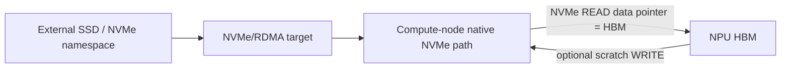

# Stage 4 Native NVMe Namespace / NPU HBM Canary

## Purpose

This path is independent of the existing Flume raw-RDMA server, Host-RA
client, NPU relay, and HCCL/HCOMM paths. It answers one narrow hardware
question:

> Can the installed Linux NVMe namespace path submit I/O with an
> `aclrtMalloc` NPU HBM address as the command data pointer?



The executable requires sysfs to identify the selected namespace controller
as `transport=rdma`; a local PCIe NVMe device cannot satisfy the gate. This
canary does not implement NVMe/RDMA discovery, Fabrics Connect, or an
NVMe initiator over raw HCCP/RA. The namespace must already be exposed as a
Linux NVMe namespace block device on the compute node by the installed
kernel/CANN/vendor stack.

## Build Isolation

The executable is built only with:

```bash
-DFLUME_ENABLE_NATIVE_NVME_HBM_CANARY=ON
```

It does not change `FLUME_ENABLE_ROCE_STORAGE` or any existing data path.
Linux, `linux/nvme_ioctl.h`, and AscendCL are required.

## Non-destructive Read Gate

Start with a namespace range whose contents may be read:

```bash
python3 tools/flume_tool.py \
  --build-dir build-native-nvme \
  --nvme-namespace <nvme-namespace-block-device> \
  --nvme-device <logical-npu-device> \
  --nvme-direction read \
  --nvme-slba <readable-lba> \
  --nvme-bytes 4096 \
  native-nvme-hbm-canary
```

The executable allocates HBM, places that HBM address directly in
`NVME_IOCTL_IO_CMD`, waits for the NVMe command, and copies the completed HBM
to host only for checksum reporting. Flume never substitutes a host payload
buffer for the submitted command.

## Scratch Write Roundtrip

This mode is destructive while the command is running. Use only an unmounted,
dedicated scratch namespace and an approved LBA range:

```bash
python3 tools/flume_tool.py \
  --build-dir build-native-nvme \
  --nvme-namespace <dedicated-scratch-namespace> \
  --nvme-device <logical-npu-device> \
  --nvme-direction write-roundtrip \
  --nvme-slba <approved-scratch-lba> \
  --nvme-bytes 4096 \
  --confirm-scratch-namespace \
  native-nvme-hbm-canary
```

Flume initializes the write pattern in HBM with `aclrtMemset`; it does not use
an H2D payload copy. It requires an exclusive block-device open and refuses a
mounted device, the first 1 MiB of the namespace, or a write without the
confirmation flag. It backs up the selected range, submits HBM -> NVMe WRITE,
submits NVMe -> HBM READ for verification, and restores the original bytes
before exit. A crash or device failure can still interrupt restoration, so
this is not safe for a production namespace.

## Result Contract

| Marker | Meaning |
|---|---|
| `step=namespace-open` | The external namespace is not mapped on this node |
| `step=namespace-qualify` | The path is not an NVMe namespace block device |
| `step=transport-qualify` | The namespace is not verified as NVMe/RDMA |
| `errno=EFAULT` / `likely_reason=hbm-pointer-rejected-by-kernel` | The native NVMe path rejected the NPU HBM address |
| `native_nvme_hbm_canary=passed` | The namespace ioctl accepted HBM and the requested I/O completed |
| `scratch_restored=yes` | Write roundtrip verified and restored its source range |

A pass is a **direct-path candidate**, not final proof that the kernel or
vendor driver used no internal bounce buffer. Final host-bypass acceptance
also requires driver tracing, counters, or vendor documentation showing that
the NVMe/RDMA data MR maps NPU HBM rather than host DRAM.

The implementation is clean-room Flume code built against the public Linux
NVMe ioctl UAPI and AscendCL allocation APIs. No NDS implementation code is
copied into this path.
