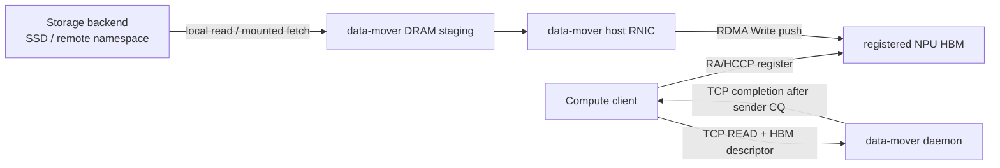
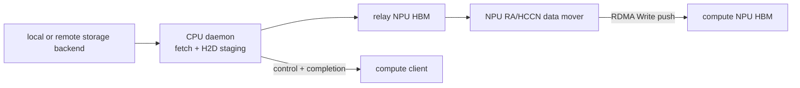
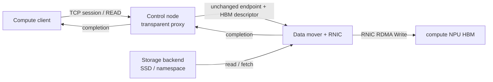

# Stage 4 Push-first Storage Routing

## Decision

Storage reads use **push** first:

```text
compute client registers target NPU HBM
  -> sends READ(offset, length, address, rkey)
  -> data mover reads/fetches the extent from the storage backend
  -> data mover RNIC performs RDMA Write
  -> sender CQ completes
  -> TCP completion is returned
```

This direction matches a storage read because the storage side owns the source
bytes and the compute side owns the destination window. `pull` remains in the
public enum and protocol flag, but opening a pull session returns a precise
unsupported result. It must not silently fall back to a host copy.

RDMA registers memory, not an SSD file. A POSIX backend therefore still reads
SSD data into storage-side staging memory before the data mover submits the
RDMA Write. The first hardware acceptance target is compute-host bypass, not
storage-side full direct DMA.

## Roles

| Role | Responsibility | Payload bytes |
|---|---|---|
| Compute client | Allocate HBM, create NPU RC QP, register HBM MR, submit read descriptor | Target only; no compute-host DRAM staging |
| CPU control server | Namespace/auth/routing, request and completion forwarding | Must be zero when operating as a transparent proxy |
| Storage backend | Own SSD/file/remote namespace and expose bytes to the data mover | No compute-side payload |
| Data mover node | Read or fetch source bytes, expose sender endpoint, submit RDMA Write, wait sender CQ | Host RNIC or NPU HCCN/RNIC; storage-side staging is currently used |

The CPU server remains necessary for policy and lifecycle management. "NPU
data mover" means the CPU prepares resources and commands while an NPU
HCCN/RNIC QP performs the payload DMA. It does not mean an NPU kernel calls
`open(2)` on the SSD.

## Implemented Routes

The storage backend and data mover do not have to be the same machine. The
current POSIX backend accepts any file path visible on the data mover, including
a mounted remote-storage namespace. A future native backend can replace that
fetch without changing the push protocol.

### Route A: data mover RNIC connects directly to compute NPU

This is the preferred first deployment when the data mover RNIC and compute NPU
HCCN endpoint share one RoCE fabric. The SSD namespace may be local to the data
mover or supplied by a separate storage backend.



Implementation: `flume-roce-storage-server` with `data_mover=host-verbs`.

### Route B: CPU server plus NPU data mover

Use this when the data mover reaches the compute NPU through its own NPU
HCCN/RNIC rather than a host verbs RNIC. Its storage input may still come from
a separate backend node.



Implementation: `flume-roce-npu-relay-server`. The RA sender dynamically
loads CANN/HCCP, creates and connects an RC QP, registers relay HBM, posts
`RaTypicalSendWr(RDMA_WRITE)`, rings `rtRDMADBSend`, and waits `RaPollCq` before
publishing completion.

This route bypasses compute-host payload memory but currently uses both
storage-host DRAM and relay HBM staging.

### Route C: separate control node and directly connected data node

This is the three-node layout. The control node may reach both peers through
ordinary TCP even when it is not attached to the RoCE payload fabric.



Implementation: `flume-roce-storage-proxy`. It forwards the client NPU
endpoint, target `address/rkey/length`, data-node endpoint, command, and
completion. It never terminates the RC QP and reports `payload_proxy_bytes=0`.
The data mover can use either Route A's host verbs sender or Route B's NPU
sender. Its POSIX path can refer to a storage namespace mounted from another
node.

## Code Map

| Area | Files | Status |
|---|---|---|
| Push/pull API | `include/flume/flume.h`, `host_ra_session.*` | Push implemented; pull reserved/unsupported |
| Wire flags and route markers | `roce_storage.*` | Implemented and unit tested |
| Transparent control proxy | `control_proxy.*`, `flume-roce-storage-proxy.cc` | Implemented and locally simulated |
| Host RNIC sender | `verbs_backend.*`, `flume-roce-storage-server.cc` | Implemented; hardware proof pending |
| NPU data mover | `npu_ra_push_mover.*`, `flume-roce-npu-relay-server.cc` | Implemented; fake-CANN and source-ABI checked; hardware proof pending |
| Pull sender | reserved protocol/API surface | TODO; no fallback |
| SSD peer/direct DMA | no backend yet | TODO |

## Local Verification

```bash
cmake -S . -B build-local-push \
  -DFLUME_BUILD_TESTS=ON \
  -DFLUME_ENABLE_HCCL=OFF \
  -DFLUME_ENABLE_ROCE_STORAGE=ON
cmake --build build-local-push -j 8
ctest --test-dir build-local-push --output-on-failure \
  -R 'roce_|cann_ra|npu_ra'
```

The proxy test verifies that endpoint and HBM descriptors survive forwarding
unchanged and that proxy payload bytes remain zero. The fake-CANN mover test
verifies MR registration, RDMA Write WR construction, doorbell submission,
send-CQ success, CQ error handling, and cleanup. Source fixture checks compare
the reduced ABI with public CANN/HCCP types.

## Hardware Commands

Build all Stage 4 targets on CANN hosts:

```bash
python3 tools/flume_tool.py \
  --build-dir build-roce-push \
  --enable-roce-storage \
  ascend-probe
```

Preferred direct data-mover route, with a local or mounted storage path:

```bash
build-roce-push/flume-roce-storage-server \
  --listen <data-mover-control-ip> \
  --storage-file <local-or-mounted-test-file> \
  --verbs-device <data-mover-rnic> \
  --verbs-port <verbs-port> \
  --gid-index <gid-index> \
  --control-port <data-mover-control-port>
```

Optional separate control proxy:

```bash
build-roce-push/flume-roce-storage-proxy \
  --listen <controller-listen-ip> \
  --control-port <controller-port> \
  --upstream <data-mover-control-ip> \
  --upstream-port <data-mover-control-port>
```

Compute client, pointed either directly at the data node or at the proxy:

```bash
build-roce-push/flume-roce-hbm-write-smoke \
  --storage-server <control-endpoint-ip> \
  --control-port <control-endpoint-port> \
  --npu-rnic-ip <compute-npu-hccn-ip> \
  --device <logical-device> \
  --gid-index <gid-index> \
  --control-mode tcp \
  --transfer-mode push \
  --bytes 4096
```

NPU data-mover variant on a node with an available NPU and a visible storage
path:

```bash
build-roce-push/flume-roce-npu-relay-server \
  --listen <data-mover-control-ip> \
  --storage-file <local-or-mounted-test-file> \
  --npu-rnic-ip <sender-npu-hccn-ip> \
  --device <logical-device> \
  --gid-index <gid-index> \
  --control-port <data-mover-control-port>
```

## Acceptance Boundary

A hardware read passes only when sender CQ succeeds, the client checksum
matches, `transfer_mode=push`, `compute_host_payload_bytes=0`, and
`fallback=none` are all present. With a proxy, require
`control_proxy=used payload_proxy_bytes=0`. Route A should report
`data_plane=remote-rnic` when proxied; Route B reports
`data_plane=npu-ra-relay`.

These markers prove that compute-host DRAM and the optional control proxy did
not carry payload. They do not prove that the storage-side CPU or DRAM was
bypassed. That later claim requires SPDK/NVMe-oF or a supported peer/direct DMA
backend and separate performance/trace evidence.
