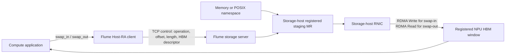

# Stage 4 Tensor Swap over Host-RA

## Goal

This path lets an application decide which byte range to swap between a
storage namespace and an Ascend NPU HBM allocation. Flume does not interpret
tensor shape, dtype, or graph ownership. The upper layer maps a tensor ID to a
storage offset and byte length; Flume owns transport setup, HBM registration,
the storage command, and completion validation.



The baseline bypasses compute-host DRAM for payload bytes. It still stages
storage data in storage-server DRAM, so it does not claim SSD-side peer DMA or
full end-to-end direct storage.

## Storage Semantics

| Flume operation | Wire operation | Server RDMA operation | Payload direction |
|---|---|---|---|
| `flume_swap_in_async` | `StorageRead` | RDMA Write | storage -> NPU HBM |
| `flume_swap_out_async` | `StorageWrite` | RDMA Read | NPU HBM -> storage |

The public helpers are thin semantic wrappers around the existing versioned
RoCE storage protocol. They use namespace object `0`; tensor identity remains
an application concern.

```c
flume_swap_in_async(session, storage_offset, dst_hbm, dst_offset,
                    bytes, stream, &io);
flume_swap_out_async(session, src_hbm, src_offset, storage_offset,
                     bytes, stream, &io);
```

Only one request may be in flight per session. The HBM buffer and its RA MR
remain alive until the matching terminal completion is observed. In TCP
control mode, command and completion metadata use TCP while payload uses the
RNIC/HCCN RC QP. In `npu-ra` control mode, the command uses RA SEND and the
server RDMA Writes the completion record into NPU HBM.

## Write Safety

Storage writes are disabled by default. Both peers must opt in:

- The server requires `--allow-writes`.
- The hardware smoke requires `--confirm-storage-write` for `write` or
  `roundtrip`.

Use write tests only with a memory namespace or a disposable scratch file.
The POSIX backend does not restore overwritten bytes.

## Two-Host Hardware Gate

Build the server on the storage host with standard libibverbs:

```bash
cmake -S . -B build-roce-server \
  -DFLUME_BUILD_TESTS=ON \
  -DFLUME_ENABLE_HCCL=OFF \
  -DFLUME_ENABLE_ROCE_STORAGE=ON
cmake --build build-roce-server --target flume-roce-storage-server -j 8
```

Start with the memory namespace. Add `--allow-writes` only for roundtrip:

```bash
build-roce-server/flume-roce-storage-server \
  --listen <control-listen-ip> \
  --namespace-bytes 67108864 \
  --verbs-device <storage-rnic-device> \
  --verbs-port <verbs-port> \
  --gid-index <storage-gid-index> \
  --control-port <control-port> \
  --allow-writes
```

Build the client on the Ascend compute host, then run both storage directions
on one connection:

```bash
cmake -S . -B build-roce-client \
  -DFLUME_BUILD_TESTS=ON \
  -DFLUME_ENABLE_HCCL=OFF \
  -DFLUME_ENABLE_ROCE_STORAGE=ON
cmake --build build-roce-client --target flume-roce-swap-smoke -j 8

build-roce-client/flume-roce-swap-smoke \
  --storage-server <storage-server-control-ip> \
  --npu-rnic-ip <npu-hccn-ip> \
  --device <logical-npu-device> \
  --gid-index <npu-gid-index> \
  --control-port <control-port> \
  --control-mode tcp \
  --operation roundtrip \
  --offset 4096 \
  --bytes 4096 \
  --confirm-storage-write
```

For a legacy CANN package, run
`build-roce-client/flume-cann-ra-compat-probe` first. If the probe reports
`physical_device_lookup=explicit-required`, add
`--physical-device <physical-npu-device>` while keeping `--device` as the ACL
logical device. Both current and legacy RA entry points feed the same swap
state machine and wire protocol.

Required client markers:

```text
flume_swap_out_path=passed
payload_path=npu-hbm->rnic->server-memory
flume_swap_in_path=passed
payload_path=server-memory->rnic->npu-hbm
flume_swap_smoke=passed operation=roundtrip
swap_out=passed swap_in=passed
hbm_window=ra-registered
compute_host_payload_bytes=0
fallback=none
```

The server must report one `storage-write/read-from-hbm` request followed by
one `storage-read/write-to-hbm` request with matching checksums. CQ success
without the final swap-in checksum is not acceptance evidence.

After the memory gate passes, replace `--namespace-bytes` with
`--storage-file <scratch-file>` to validate SSD/POSIX staging. Start with TCP
control. Test `--control-mode npu-ra` only after the payload path is stable.

## Clean-Room Boundary

This implementation uses Flume's existing independently written wire format,
CANN RA loader, standard libibverbs backend, and storage abstraction. NDS
documentation was used only to compare high-level endpoint roles and storage
operation semantics. No NDS source implementation, declarations, constants,
or wire layout were copied.
