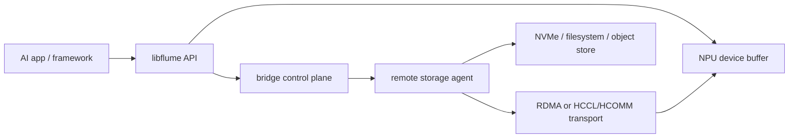
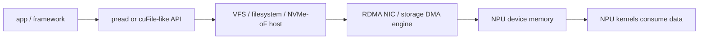

# Flume 调研笔记

调研日期：2026-08-03

目标：基于 Ascend CANN 开源 HCCL/HCOMM 通信能力，探索 Flume: Host-Bypass Data Path for Ascend NPU，使 NPU 可经 HCCL/HCOMM/RDMA 类路径访问远端存储或其他 NPU HBM，并尽量让应用上层无感知。

## 结论先行

1. 短期不建议直接照搬 GDS 的内核文件系统路径。NVIDIA GDS 的关键是 `libcufile` + 内核/文件系统回调 + GPU 内存 DMA 映射能力；在 Ascend 公开 HCCL/HCOMM API 中，目前能明确看到的是 NPU 间通信能力，而不是面向通用存储/NIC 的 NPU 设备内存导出接口。
2. 第一阶段可行目标应定义为“计算节点 CPU 不参与数据搬运或仅参与控制面”。可先通过 HCCL/HCOMM 的 RoCE 数据通道、通信内存和自定义通信算子构建桥接原型，验证远端数据进入 NPU buffer 的吞吐、延迟、CPU 占用和与计算流重叠能力。
3. 真正的端到端 peer DMA 目标，即远端 NVMe-oF/RDMA 数据直接落入 NPU device memory，需要确认 Ascend 驱动是否有公开或可合作使用的 device memory pin/export/register 能力。若没有，该目标很可能需要厂商驱动支持，而不是单靠 HCCL 算子层改造。
4. 应用无感知可以分层推进：先提供显式 `flume_pread_async()` 类 API，再做 PyTorch/数据加载框架适配，最后才考虑 `LD_PRELOAD` 拦截 `pread/read` 或文件系统级透明化。

## 背景事实

### HCCL/HCOMM 能提供什么

HCCL 是 CANN 的集合通信库，支持单机/多机的集合通信和点对点通信，官方文档列出的链路包括 HCCS、RoCE、PCIe。HCCL 由 HCCL 通信算子层和 HCOMM 通信基础库组成，HCOMM 按控制面和数据面解耦：控制面负责拓扑与资源管理，数据面负责数据搬运、同步和本地操作。

HCCL API 面向框架开发者提供集合通信与 P2P 通信，包括 `HcclSend`、`HcclRecv`、`HcclBatchSendRecv`，以及通信域创建、销毁、错误查询等接口。公开 API 列表也出现了零拷贝相关接口，如 `HcclCommSetMemoryRange`、`HcclCommActivateCommMemory`，但文档同时标注这类接口仅支持 Ascend Extension for PyTorch 插件后端代码调用，且为试用接口，不能简单视为通用商用稳定接口。

HCOMM 的通信模型对本项目非常关键：

- 通信内存可以注册给通信域，使通信域内其他通信成员访问。
- Endpoint 表示通信端口，可以带地址和协议属性。
- Channel 是本地 Endpoint 与远端 Endpoint 之间的通信通道。RoCE 场景下 Channel 关联 QP，并包含 Notify 用于同步。
- 网络语义模型允许通过 Channel 访问远端通信对象内存或进行同步。
- 内存语义模型允许远端通信内存映射到本地进程地址空间，但公开文档强调该模型主要是 HCCS/PCIe 场景；RoCE 侧更应先按网络语义理解。

HCCL profiling 文档显示，机间 RoCE 同步和数据任务在 Profiling 中体现为 `RDMASend`，数据任务的 `RDMASend` 主要反映 WQE 下发到 QP 队列的耗时，实际通信耗时需要结合数据量、带宽或后续 notify wait 分析。这对后续性能定位很有用。

### NVIDIA GDS/GDR 的参考意义

GPUDirect Storage 的核心路径是让存储附近的 DMA engine，例如 NVMe 或存储 NIC，在合适拓扑下直接读写 GPU memory，绕过 CPU bounce buffer。GDS 对应用暴露的是 cuFile API，支持注册文件句柄、注册 GPU buffer、同步/异步 read/write，并在不满足直通条件时回退到兼容路径。

GPUDirect RDMA 的核心是 PCIe peer-to-peer 和 GPU memory 映射能力。NVIDIA 文档强调第三方设备通过 PCIe 访问 GPU BAR 空间，同时也提示现代路径正在转向 dma-buf 导出能力。这里对 Ascend 的启发是：是否存在或能获得 NPU device memory 的等价 pin/export/SG-list/RKey 能力，是决定能否做“真直通”的关键。

### 远端存储/RDMA 侧的常见基座

远端块存储可以用 NVMe-oF/RDMA 或 SPDK 构建。SPDK NVMe-oF target 支持 RDMA/TCP transport，也和 Linux kernel NVMe-oF host/target 互通。SPDK 文档中的 RDMA zero-copy 是“RDMA NIC 到 host memory，再到 SSD 或反向，不发生 host memory 内部额外拷贝”。这仍然不是直接到 NPU memory，但可作为远端存储端和基准工具。

## 问题拆解

“NPU 经 RDMA 访问远端存储”至少有三种强度不同的目标：

| 目标层级 | 含义 | 可行性判断 |
| --- | --- | --- |
| L1 控制面透明 | 应用调用框架/库 API，不直接关心 RDMA/HCCL；数据仍可能经 host staging | 可做，适合作为 MVP |
| L2 计算节点 CPU bypass | 远端数据通过 RDMA/HCCL 类通道进入 NPU buffer，计算节点 CPU 不做数据拷贝 | 有希望，但需限制在 HCCL/HCOMM 能管理的通信参与方和内存模型内 |
| L3 端到端 peer DMA | 存储 NIC/NVMe-oF 直接 DMA 到 NPU device memory，类似 GDS | 高风险，取决于 Ascend 驱动是否公开 NPU memory export/register 能力 |

Flume 第一版目标建议定为 L1+L2，而不是承诺 L3。

## 推荐架构路线

### 路线 A：显式库 + 框架适配，先跑通端到端基准



建议接口：

```c
typedef struct flume_file flume_file_t;
typedef struct flume_io flume_io_t;

int flume_open(const char *uri, int flags, flume_file_t **out);
int flume_register_npu_buffer(void *npu_ptr, size_t len, uint64_t flags);
int flume_pread_async(flume_file_t *file, void *npu_ptr, size_t len,
                     uint64_t file_off, aclrtStream stream, flume_io_t **io);
int flume_pwrite_async(flume_file_t *file, const void *npu_ptr, size_t len,
                      uint64_t file_off, aclrtStream stream, flume_io_t **io);
int flume_poll(flume_io_t *io);
int flume_close(flume_file_t *file);
```

这个 API 不强行伪装成 POSIX，但能把异步、stream 同步、buffer 注册和降级策略表达清楚。上层无感知可以通过 PyTorch Dataset/DataPipe、MindSpore 数据管道、或少量框架后端适配完成。

### 路线 B：HCCL/HCOMM 通信算子桥接

思路：把“远端存储读出的数据块”包装成通信 payload，使用 HCCL P2P 或 HCOMM 自定义通信算子把数据送入 NPU buffer。

关键限制：HCCL/HCOMM 的通信参与方通常是 Ascend 设备通信成员。纯存储服务器如果没有 Ascend 设备或 HCOMM 可用 endpoint，不能天然成为 HCCL rank。因此该路线更适合以下场景：

- 存储代理部署在带 Ascend 设备的网关节点上。
- 或者计算节点侧有本地 bridge daemon，先经 NVMe-oF/RDMA 拉到注册 host/pinned memory，再通过 ACL/HCCL 进入 NPU。这个形态不是真 L3，但能先验证上层 API 和调度。
- 或者厂商提供 HCOMM 对非 NPU endpoint 的扩展能力，可以让 storage agent 作为特殊通信对象接入。

### 路线 C：GDS 类内核/驱动路径，作为长期目标



这条路线需要至少解决：

- NPU device memory 的 pin/export，最好是 dma-buf 或等价 fd/handle。
- 对 RDMA verbs/NVMe-oF/file-system 层可用的 scatter-gather list、IOVA、权限与生命周期管理。
- 与 ACL stream、HCCL stream、NPU kernel 的同步语义。
- IOMMU/ACS/PCIe root complex、NUMA、RoCE 网卡与 NPU 拓扑约束。
- 出错回退路径和安全隔离。

如果没有厂商驱动协作，不建议把它作为第一个里程碑。

## 技术风险清单

1. 设备内存导出风险：公开资料不能证明 `aclrtMalloc` 或 HCCL 激活内存可被通用 `ibv_reg_mr` 或 NVMe-oF 栈注册。
2. 协议不匹配：HCCL 是通信库协议，NVMe-oF 是存储协议。HCCL 不能直接“挂载”远端 NVMe-oF target，必须有桥接层翻译协议和调度。
3. 通信成员限制：HCCL rank 通常绑定 NPU 设备，纯存储节点很难直接成为 HCCL 通信域成员。
4. 零拷贝接口成熟度：HCCL 零拷贝相关公开接口被标注为试用，并限定后端调用场景。
5. 同步语义：文件 I/O 完成、RDMA completion、HCCL notify、ACL stream event、NPU kernel 读取之间必须有明确 happens-before。
6. 拓扑约束：GDR/GDS 类路径通常受 PCIe root complex、IOMMU、ACS、NUMA 和 NIC/NPU 亲和性影响。
7. 小 I/O 与非对齐：GDS 会处理非对齐、小块、fallback；本项目也需要兼容策略，否则上层无感知会破。
8. 故障恢复：RDMA CQE error、远端存储超时、通信域挂起、NPU UCE 等需要统一错误模型。
9. 安全隔离：RKey/token、远端地址、租户隔离、ACL、加密或可信网络边界都不能后补。

## MVP 建议

### 第 0 阶段：基线与环境确认

- 准备 Ascend A2/A3 或目标硬件、匹配版本 CANN、HCCL/HCOMM 源码与 HCCL Test。
- 跑通 HCCL P2P：`HcclSend`、`HcclRecv`、`HcclBatchSendRecv`。
- 开启 profiling，确认跨节点 RoCE 路径中出现 `RDMASend` 数据任务。
- 跑标准 host 路径：远端 NVMe-oF 或 NFS/并行 FS read -> host pinned buffer -> `aclrtMemcpyAsync` -> NPU。
- 记录 block size 从 4 KiB、64 KiB、1 MiB、16 MiB、128 MiB 到 1 GiB 的吞吐、P50/P99、CPU 利用率、NPU stream overlap。

### 第 1 阶段：显式 Bridge API

- 实现 `libflume` 的同步/异步读写接口和 buffer 注册表。
- 先允许 host staging fallback，保证功能正确。
- 对上提供 PyTorch/torch_npu 示例：把 dataset chunk 直接读入 NPU tensor 的 storage 指针，失败时回退普通路径。
- 建立 correctness 测试：随机 offset、非对齐 size、checksum、并发队列、取消和超时。

### 第 2 阶段：HCCL/HCOMM 数据通道实验

- 用 HCCL P2P 做 storage-proxy-rank 到 compute-rank 的块传输基准。
- 如果 HCOMM 自定义算子接口可用，尝试基于 Channel/Notify 编排 `read block -> write remote comm memory -> notify` 的自定义算子。
- 比较 `HcclBatchSendRecv` 与自定义 Channel primitive 在大块和小块下的 CPU 下发开销、带宽、tail latency。

### 第 3 阶段：真直通可行性门禁

在进入内核或 NVMe-oF host/target 改造前，必须得到以下任一答案：

- Ascend/CANN 是否提供 NPU device memory 的 dma-buf 或等价导出能力。
- 是否有面向第三方 RDMA NIC 的 NPU memory registration API。
- 是否有 HCOMM/驱动层 API 能把外部 RDMA endpoint 接入通信内存模型。
- 是否允许修改或扩展 CANN runtime/HCCL/HCOMM 相关驱动模块。

如果答案是否定的，项目应保持为“上层无感知 + 计算节点少拷贝/少 CPU”的桥接库，而不宣称 GDS 等价。

## 验证指标

| 维度 | 指标 |
| --- | --- |
| 性能 | GB/s、IOPS、P50/P95/P99 latency、CPU utilization、NPU stream overlap |
| 数据路径 | host copy 次数、device copy 次数、RDMA bytes、PCIe/NIC counters、HCCL `RDMASend` 任务 |
| 兼容性 | 对齐/非对齐、小文件/大文件、顺序/随机、读/写、并发 QD |
| 稳定性 | 长稳、断链、storage timeout、RDMA CQE error、通信域 suspend/resume |
| 上层透明 | 框架改动行数、是否支持 fallback、是否可通过 env/config 控制 |

## 资料来源

- Huawei Ascend HCCL Overview：HCCL 支持集合/P2P 通信、HCCS/RoCE/PCIe 链路，以及 HCCL/HCOMM 分层架构。<https://www.hiascend.com/document/detail/en/canncommercial/850/commlib/hcclug/hcclug_000001.html>
- Ascend cann-hccl README：源码仓包含通信框架和通信算法，说明算法、版本配套和编译方式。<https://gitee.com/ascend/cann-hccl/blob/master/README.md?skip_mobile=true>
- HCOMM 通信模型：通信内存、Endpoint、Channel、RoCE QP、Notify、网络语义和内存语义模型。<https://gitcode.com/cann/hcomm/blob/master/docs/zh/comm_op_dev_guide/prog_models_concepts/comm_model.md>
- HCCL API 列表：集合/P2P API、通信域管理 API、零拷贝相关接口和限制说明。<https://www.hiascend.com/document/detail/zh/canncommercial/850/API/hcclapiref/hcclcpp_07_0001.html>
- HCCL Profiling 行为：`RDMASend` 在 RoCE 同步和数据通信任务中的表现。<https://gitcode.com/cann/hccl/blob/master/docs/zh/user_guide/perf_analysis/profiling_op_behavior.md>
- NVIDIA GPUDirect Storage Overview：cuFile API、direct DMA、compatibility/fallback、`nvidia-fs.ko` 角色。<https://docs.nvidia.com/gpudirect-storage/overview-guide/>
- NVIDIA GPUDirect RDMA：PCIe P2P、BAR 映射、dma-buf/device attribute 方向。<https://docs.nvidia.com/cuda/gpudirect-rdma/>
- SPDK NVMe-oF Target：RDMA transport、Linux kernel interoperability、RDMA prerequisites。<https://spdk.io/doc/nvmf.html>
- SPDK NVMe-oF Target Programming Guide：RDMA transport zero-copy 到 host memory、poll group 和 lockless I/O path。<https://spdk.io/doc/nvmf_tgt_pg.html>
